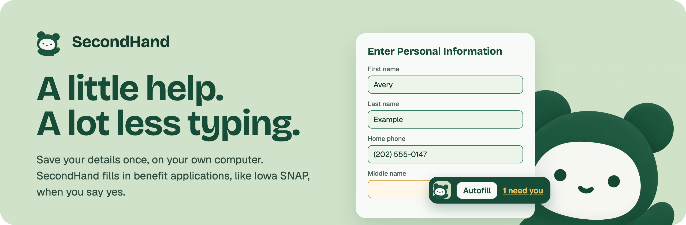
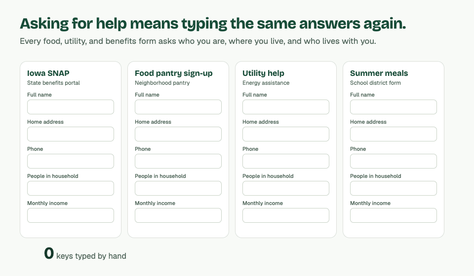
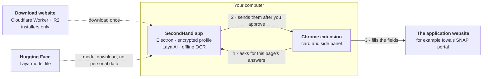
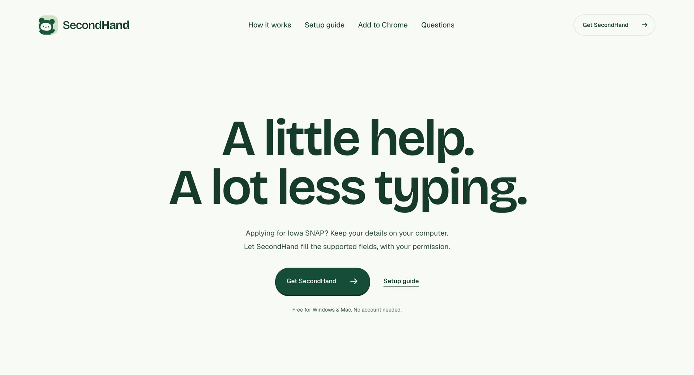

<p align="center">
  
</p>

<h1 align="center">SecondHand</h1>

<p align="center">
  <strong>Enter your details once. Fill benefit applications in one click. Your details are stored only on your own computer.</strong>
</p>

<p align="center">
  <a href="https://secondhand.ethanpam.workers.dev"><strong>Download SecondHand 0.5.0</strong></a>
  &nbsp;·&nbsp; <a href="#watch-the-film">Watch the film</a>
  &nbsp;·&nbsp; <a href="docs/setup.md">Setup guide</a>
  &nbsp;·&nbsp; <a href="#tech-stack-and-architecture">How it's built</a>
  &nbsp;·&nbsp; <a href="#what-it-costs-to-run-for-a-year">Yearly cost</a>
  &nbsp;·&nbsp; <a href="CONTRIBUTING.md">Contribute</a>
</p>

<p align="center">
  Free and open source (MIT) &nbsp;·&nbsp; Windows and Mac &nbsp;·&nbsp; No account, no cloud, no analytics &nbsp;·&nbsp; Built for <a href="#why-it-matters">Hack Away Hunger 2026</a>
</p>

> [!IMPORTANT]
> SecondHand is an early pilot. It is independent software, not part of Iowa HHS, and it does not decide who qualifies. It fills in and checks answers; you review them, sign, and submit.

## Contents

1. [What is SecondHand?](#what-is-secondhand)
2. [Why it matters](#why-it-matters)
3. [Watch the film](#watch-the-film)
4. [How you use it](#how-you-use-it)
5. [What it does today](#what-it-does-today)
6. [Tech stack and architecture](#tech-stack-and-architecture)
7. [Privacy and safety](#privacy-and-safety)
8. [What it costs to run for a year](#what-it-costs-to-run-for-a-year)
9. [Get started](#get-started)
10. [How a new form gets supported](#how-a-new-form-gets-supported)
11. [Roadmap](#roadmap)
12. [For developers](#for-developers)
13. [License and credits](#license-and-credits)

## What is SecondHand?

SecondHand is a free program that helps people fill out benefit applications, starting with Iowa's SNAP application (food assistance, sometimes called food stamps).

It comes in two parts that work together:

| Part | What it does |
| --- | --- |
| **The SecondHand app** for Windows and Mac | You type your details once: your name, address, phone, the people you live with, income, and so on. The app keeps them in an encrypted file on your own computer, locked with your password. |
| **The SecondHand Chrome extension** | When you open an application in Chrome, a small SecondHand card appears in the corner. Click **Autofill** and it fills in the questions it knows from your saved details, then shows you what still needs you. |

Think of it like a password manager, but for the questions every assistance form asks. Nothing goes to a SecondHand server, because there isn't one. You stay in charge: the app asks before it shares anything, and you always review, sign, and submit yourself.

<p align="center">
  
  <br>
  <sub>A fictional applicant on a synthetic copy of Iowa's form. Nothing is sent anywhere.</sub>
</p>

## Why it matters

**The problem.** When a family needs help with food, rent, or utilities, they usually have to apply to several programs. Each one has its own website and its own forms, and nearly all of them ask the same questions: who you are, where you live, who lives with you, and what you earn. Then many programs ask again at renewal time. Agencies keep separate systems that don't share information, so the work of copying the same answers falls on the person who has the least time to spare.

<p align="center">
  
  <br>
  <sub>An illustration with a fictional applicant. SecondHand fills supported fields; you check every answer.</sub>
</p>

**Why it's worth solving.** At the Hack Away Hunger kickoff panel in September 2026, Iowa's food-security leaders named the same gap again and again:

- *"The scarcest resource for people in need is time, not money."* (Matt Unger, former CEO of DMARC)
- The Iowa Food Bank Association's SNAP hotline has 5 staff answering about 260 calls a day and helping with about 1,000 applications a month.
- FindHelp saw about 1 million searches for services in Iowa in the past year, and 24% of them were for food.
- The average Iowa SNAP benefit is about $170 per person per month: real help that people miss out on when the paperwork is too much.

The panel's number one technology wish was a **single point of entry**: a "passport" where a person enters their information once and it fills in everywhere, the way MyChart works for health records. They also set clear limits: protect privacy and dignity, keep costs near zero, don't make AI a critical dependency, and don't ask agencies to change their systems.

**How SecondHand answers that.**

| What the panel asked for | What SecondHand does |
| --- | --- |
| One place to enter information once | A saved profile on your computer fills supported forms in one click |
| Less paperwork and fewer repeated visits | No retyping the same answers; saved notes and dates for each application |
| Privacy and dignity for vulnerable people | Everything stays on your computer, encrypted; no account, no analytics |
| Low-cost and sustainable | $0 a year to run today ([see the costs](#what-it-costs-to-run-for-a-year)) |
| AI is optional, never required | Plain rules do the filling; the small local AI model can be switched off |
| No changes needed from agencies | Works on the existing websites as they are |
| Keep the human connection | Removes copying, so caseworkers and navigators can spend time on people |

SecondHand was built for **Hack Away Hunger**, the DSMHack / CharityHack 2026 hackathon in Des Moines on food insecurity in Iowa.

## Watch the film

<p align="center">
  <a href="https://secondhand.ethanpam.workers.dev/media/secondhand-film.mp4">
    
  </a>
  <br>
  <sub>A 46-second animated film about what SecondHand does. Click the picture to play it in your browser (MP4, 3 MB, with narration).</sub>
</p>

## How you use it

**1. Save your details once.** A short guided setup takes about five minutes: you (including whether you're a student), your household, where you live, income and where it comes from, the benefits you get now and the help you're looking for, and Iowa's questions about you. Skip any step and come back later.

| Your saved details, in the desktop app | The overview |
| --- | --- |
|  |  |

**2. Click Autofill on the application.** Open Iowa's SNAP application in Chrome and click **Autofill** in the SecondHand card. The app asks first: **Allow once**, or **Always allow on this computer**.

**3. Finish what's left, then submit it yourself.** A yellow **need you** link jumps to each missing answer. Chrome's side panel lists every question on the page as **Done**, **Needs you**, **Optional**, or **Do it yourself**.


## What it does today

Version **0.5.0**, released October 6, 2026.

- **Keeps your details on your computer.** Your profile and application notes are in an encrypted file that only your password or recovery key opens. There is no account, no cloud copy, and no analytics.
- **Knows your household.** List the people you live with once. SecondHand works out the counts forms ask for, such as "How many people 0 to 17?", and never guesses a guardian's name.
- **Fills Iowa's SNAP application screen by screen.** It fills what it knows, moves past screens that only give information, and stops wherever you're needed. CAPTCHA, consent, signatures, and final submission are always yours.
- **Speaks your language.** The side panel works in English, Spanish, Vietnamese, Chinese, French, and Arabic. It can show Iowa's questions in your language and sum up long pages in plain words, using Chrome's built-in translator and summarizer on your computer.
- **Works on other forms too.** Turn SecondHand on for any secure website, such as a food pantry's sign-up form. It reads each question's label and fills only the ones it recognizes.
- **Answers food pantry sign-up questions (coming in the next release).** Questions such as "Student status", "Assistance needed", "Source of income" and "Does anyone in your family receive cash assistance?" are answered from what you saved, but only when exactly one option matches. Otherwise the question stays with you.
- **Remembers your own answers (new in 0.5.0).** When you answer a question SecondHand didn't know, it offers to remember it for next time, with your permission. Up to 50 custom answers, encrypted with your profile.
- **Fill and continue (new in 0.5.0).** On recognized multi-page forms, it can fill and click ordinary **Next** buttons, and stops for anything missing, consent, signatures, payments, or submission.
- **Reads your documents on your computer.** Open a PDF or photo of a tax form such as a W-2 or 1040, and SecondHand reads it with offline text recognition and suggests details for you to review. Nothing is uploaded.
- **Answers some questions the rules miss, as a guess.** Laya, a small AI model that runs inside the app, picks an answer from your saved facts when it's confident, and marks it as a guess for you to check. It runs on Windows and Apple-silicon Macs, and you can turn it off.

<details>
<summary><strong>Exactly which Iowa screens are covered</strong></summary>

Autofill stays on for the tab until you click **Stop**, lock SecondHand, leave Iowa's site, or reach a screen it doesn't know. It also stops after 64 automatic steps so you can check where you are.

| Iowa screen | What SecondHand does |
| --- | --- |
| Household Application Information | Picks **Yes** when one of your saved programs is a clear yes. You solve the CAPTCHA and continue. |
| Before You Start, Important Information, Instructions | Clicks Continue for you. These screens send no answers. |
| Let's get started, About you | Waits for you to accept Iowa's consent or click Continue. |
| **Enter Personal Information** | Fills your saved names, phones, home and mailing addresses, and program choices. Waits for missing required answers, then clicks Save and Continue. |
| Select Address (verified home-only layout) | Picks Iowa's first suggested home address and continues. Check it before you submit. |
| Tell Us More | Fills matching saved answers. The fully captured layout can continue only when all visible questions are recognized and answered. |
| Captured screening pages | Emergency, Background, Job, Income, Expenses, and Property Information use saved answers and continue only when every visible question is supported and complete. |
| Captured financial records | One job, Private Pension/Social Security income, rent, a utility record, or a Cash/Uncashed Check asset. You choose among matching saved records. |
| Other Iowa pages | May fill matching saved answers after you approve, and Laya's answers marked as guesses. You continue. |
| CAPTCHA, consent, signatures, final Submit | Never touched. |

[Portal coverage](docs/iowa-portal.md) has the exact field list, and [SNAP preparation](docs/snap-information.md) covers jobs, expenses, property, and tax references.

</details>

## Tech stack and architecture

**What kind of software is it?** SecondHand is **free, open-source desktop software** under the MIT license. It is **not a hosted SaaS**: there is no SecondHand server, database, or user account. Each person's data lives only on their own computer. The only thing hosted online is the download website, which serves the installers and holds no applicant data.



The extension talks to the app through Chrome's native messaging, a direct connection between two programs on the same computer. For each page it asks only for the answers that page needs, and only while the app is unlocked. Filling a field shares that answer with the website, as typing it would.

| Layer | Technology | Why |
| --- | --- | --- |
| Desktop app | [Electron](https://www.electronjs.org/) 44, plain HTML/CSS/JavaScript | One codebase for Windows and Mac; no framework to keep up with |
| Encrypted storage | AES-256-GCM, scrypt password keys, optional macOS Keychain / Windows DPAPI for Touch ID and password reset | Strong, standard encryption with a recovery key; [security design](docs/security.md) |
| Browser extension | Chrome Manifest V3, content scripts, side panel, native messaging | Works on existing websites without any change from the agency |
| Form understanding | Hand-mapped Iowa adapter plus general label rules ([`extension/`](extension)) | Deterministic and testable; no AI needed for the core |
| Local AI (optional) | [Laya](docs/laya-model.md), a small fine-tuned model run with [ONNX Runtime](https://onnxruntime.ai/) on the computer's processor | Handles oddly worded questions offline; about 429 MB, free, Apache-2.0 |
| Document reading | [Tesseract.js](https://tesseract.projectnaptha.com/) OCR and [pdf.js](https://mozilla.github.io/pdf.js/), bundled | Reads PDFs and photos with no upload |
| Translation and summaries | Chrome's built-in Translator and Summarizer APIs | Runs in the browser on the computer, no API keys |
| Phone apps (prototypes) | Swift / SwiftUI with a Safari extension ([`ios/`](ios/README.md)); Kotlin ([`android/`](android/README.md)) | For people without a laptop |
| Download website | React with [Vinext](https://github.com/cloudflare/vinext), on a Cloudflare Worker with installers in R2 ([`website/`](website/README.md)) | Free tier, no download fees, no trackers |
| Tests | Node's test runner, jsdom, Playwright (Electron and Chromium) | 1,700+ tests on synthetic data only |

## Privacy and safety

- **Your details stay in the desktop app.** Chrome's extension storage and Chrome Sync never hold applicant information.
- **Nothing is filled without your yes.** The app asks before filling unless you choose **Always allow on this computer**, which you can turn off. Locking the app, by hand or after 10 idle minutes, stops autofill.
- **The extension stays in its lane.** It runs only on Iowa's secure portal and on sites you turn on. It fills nothing until you click **Autofill**, and never fills passwords, verification codes, or signatures. On sites other than Iowa's, sensitive details such as your Social Security number, income, or the benefits your household gets ask again unless you chose **Always allow**.
- **The website sees what's on its form.** A website can read or save answers as they're entered, just as if you typed them.
- **Laya runs on your computer.** Its only network traffic is downloading the model from Hugging Face and checking for a newer one once a day. No profile data is sent anywhere.
- **Backups are yours.** An encrypted backup opens only with the password or recovery key it was saved with.
- **An unlocked computer is still a computer.** SecondHand can't protect against malware or other programs running as you. See [the security design](docs/security.md) and [how to report a security problem](SECURITY.md).

## What it costs to run for a year

Because SecondHand runs on each person's own computer, there are no servers to pay for. Here is the full picture, checked against current prices in October 2026.

**Running it today: $0 a year.**

| Item | What it's for | Cost per year |
| --- | --- | --- |
| Cloudflare Workers, free plan | The download website's pages and download route (up to 100,000 requests a day) | $0 |
| Cloudflare R2, free tier | Storing installers: about 0.47 GB per release, 10 GB free; downloads have no bandwidth fees | $0 |
| Hugging Face | Hosting the Laya model file (429 MB) | $0 |
| GitHub, public repository | Code, issues, and reviews | $0 |
| Software licenses | Electron, Tesseract.js, pdf.js, ONNX Runtime, React, Laya: all open source | $0 |
| AI or API usage | None. Laya runs on the user's computer; translation uses Chrome's built-in tools | $0 |
| Servers and databases for user data | None. Data never leaves the user's computer | $0 |
| **Total** | | **$0** |

**Recommended before a wider release: about $236 the first year, $231 after.**

| Item | Why | Cost per year |
| --- | --- | --- |
| Apple Developer Program | Sign and notarize the Mac app so macOS doesn't warn people; also needed for the iPhone app | $99 |
| Windows code signing (Azure Artifact Signing, Basic) | Sign the Windows installer so Windows doesn't warn people | $119.88 ($9.99 a month) |
| A domain name, such as secondhand.org | An easy address to share (optional) | about $12 |
| Chrome Web Store registration | Install the extension from the store instead of Developer mode | $5 once |

**Projected data usage.** Each release stores about 0.47 GB (three installers of 145 to 172 MB plus the extension). Keeping the last four releases uses about 2 GB, well under the 10 GB free tier. If 1,000 people download SecondHand each month, that is about 155 GB of downloads a month, which costs nothing on R2 because it doesn't charge for bandwidth, and about 2,000 storage reads, against 10 million free. The website would need Cloudflare's $5-a-month plan only if it passed 100,000 requests in a single day. Each new install also downloads Laya (429 MB) from Hugging Face, which is free.

**The real cost is people's time.** The biggest ongoing need is volunteer or staff time: checking Iowa's pages when the state changes its portal, mapping new forms, and building and testing each release. Sources: [Cloudflare R2 pricing](https://developers.cloudflare.com/r2/pricing/), [Workers limits](https://developers.cloudflare.com/workers/platform/limits/), [Azure Artifact Signing pricing](https://azure.microsoft.com/en-us/pricing/details/trusted-signing/), [Apple Developer Program](https://developer.apple.com/programs/), [Chrome Web Store registration](https://developer.chrome.com/docs/webstore/register).

## Get started

1. **Install.** [Download SecondHand](https://secondhand.ethanpam.workers.dev) for Windows, or the Mac version for your chip. On a Mac, drag SecondHand into Applications and open it from there. These pilot builds are unsigned, so your computer may show a warning first.
2. **Create a password.** Save the recovery key the app shows you somewhere safe, away from the computer.
3. **Add the extension to Chrome.** In the app, open **Chrome extension** and click **Prepare Chrome extension**. In Chrome, go to `chrome://extensions`, turn on **Developer mode**, click **Load unpacked**, and choose the folder the app prepared. You only do this once. The website has [a picture guide](https://secondhand.ethanpam.workers.dev/chrome-extension).
4. **Apply.** Keep SecondHand unlocked, open [Iowa's portal](https://hhsservices.iowa.gov/apspssp/ssp.portal) in Chrome 116 or newer, and click **Autofill**.
5. **Finish it yourself.** Review every answer, do the consent, signatures, and submission, and save Iowa's confirmation number under **Applications** in the app.

The [setup guide](docs/setup.md) covers each step in detail, including what to do when something goes wrong.

<details>
<summary><strong>Updating from an earlier version</strong></summary>

Install the new app and open it. The next time you use the extension, SecondHand refreshes its files and reloads itself in Chrome, once nothing is filling. Reload any form page that was open after you save or finish it. Keep **Developer mode** on at `chrome://extensions`, or Chrome turns SecondHand off.

Coming from a version without automatic updates, such as 0.4, do it by hand once: open **Chrome extension** in the app and click **Refresh extension files**, then click **Reload** for SecondHand at `chrome://extensions` and reload your Iowa tab.

</details>

<p align="center">
  <a href="https://secondhand.ethanpam.workers.dev"></a>
  <br>
  <sub>The download website, where the installers live.</sub>
</p>

## How a new form gets supported

Reviewers asked the right question: does every new form need someone to write code? Mostly, no.

- **Most forms need no code of their own.** The general rules in [`extension/generic-adapter.js`](extension/generic-adapter.js) read each question's label, autocomplete hint, and accessible name, the same way a screen reader does. They fill only what they recognize, never change an answer already there, and never submit. A test fills a made-up food pantry form that has no special code at all.
- **Your own answers fill the gaps.** When a form asks something new, you answer it once, and SecondHand offers to remember it for that same question next time.
- **Laya handles odd wording.** On 15 real forms collected after training that nobody wrote code for, 57 of Laya's 72 filled answers matched the answer key, 10 more were right by the saved facts, and 5 were wrong. That's why every Laya answer is marked as a guess. [Details](docs/laya-model.md#final-holdout).

  <p align="center">
    
    <br>
    <sub>Laya scoring a made-up pantry form's questions. The scores are the real model's.</sub>
  </p>

- **Iowa's SNAP pages are mapped by hand, on purpose.** For the most important form, each page was checked in a consented live walk-through, saved as a sanitized test copy, and given its own tests. If Iowa changes a page, SecondHand notices the mismatch and fills nothing rather than guessing.

## Roadmap

Ideas from the Hack Away Hunger reviewers and where they stand:

| Idea | Status |
| --- | --- |
| Translation for people who don't read English | Done: six languages in the side panel |
| Plain-language summary of long pages | Done: "What this page says" in the side panel |
| Forms beyond SNAP (food pantries, utility help, job programs) | Started: works on any site you turn on, with custom answers |
| Family members (fill for a spouse or child) | Partly: a household list fills counts and a student's details; separate profiles are next |
| Life-event alerts ("You moved, update these programs") | Planned |
| Finding the right form on complex sites | Planned |
| Showing programs you may qualify for | Planned, without deciding eligibility |
| Signed installers and the Chrome Web Store | Planned, see [costs](#what-it-costs-to-run-for-a-year) |

Want to help with one of these? Read [CONTRIBUTING.md](CONTRIBUTING.md).

## For developers

Requires Node.js 22.12 or newer (24 recommended) and npm. No server, database, API keys, or account is involved.

```sh
npm ci
npm run check
npm test
npm start
```

For live reloading, run `npm run dev` (run `npx playwright install chromium` once first). It opens the desktop app and a separate Chromium with this repository's `extension/` loaded.

<details>
<summary><strong>All commands</strong></summary>

| Command | What it does |
| --- | --- |
| `npm start` | Runs the desktop app. |
| `npm run dev` | Runs the app and a Chromium with the extension, reloading on edits. |
| `npm test` | Unit tests: encryption, messaging, schema, portal adapters, and the extension's panels. |
| `npm run check` | Syntax checks, the extension's permission rules, and a newer `BUILD` whenever `extension/` changed since main. |
| `npm run test:coverage` | Unit tests with coverage floors from `scripts/coverage.cjs`. |
| `npm run test:ui` | Drives the real Electron app end to end. Needs a desktop session. |
| `npm run test:extension` | Runs the extension in an isolated Chromium against synthetic Iowa pages and a made-up pantry form. |
| `npm run test:translation` | Checks the language picker, translated questions, and right-to-left Arabic. |
| `npm run test:summary` | Checks the side panel's "What this page says". |
| `npm run test:laya` | Checks Laya's fills on a synthetic pantry form, with the desktop app stubbed. |
| `npm run test:ocr` / `test:ocr:ui` | Exercises offline OCR, and reads a synthetic tax form in the desktop app. |
| `npm run test:native` | Tests the native messaging protocol. |
| `npm run extension:zip` | Packages the extension. |
| `npm run dist:win` / `npm run dist:mac` | Builds the Windows installer or the Mac DMGs (Apple silicon and Intel). |
| `npm run release:checksums` | Writes SHA-256 checksums for the release files. |

Website commands (`npm test`, `npm run typecheck`, `npm run lint`, `npm run build`, `npm run deploy`) run in `website/`; see [its README](website/README.md).

</details>

Tests use only the fictional profile in [`tests/fixtures/applicant-profile.json`](tests/fixtures/applicant-profile.json), in isolated browsers with every Iowa request blocked. There is no hosted CI: run `npm test` and `npm run check` locally, plus the Electron, browser, OCR, and Laya checks your change touches, before opening a pull request.

| Folder | What's inside |
| --- | --- |
| `desktop/` | Electron main process, encrypted storage, native messaging host, Laya, and OCR |
| `renderer/` | The desktop app's interface |
| `extension/` | The Chrome extension: on-page card, side panel, background worker, and form adapters |
| `shared/` | Profile and application schema, and the portal allowlist |
| `website/` | The download website |
| `ios/`, `android/` | Phone app prototypes |
| `ML_model/` | Training data and evaluation for Laya |
| `tests/`, `scripts/` | Unit tests, fictional fixtures, smoke tests, and packaging |
| `docs/` | Guides and design notes |

**Documentation:** [setup](docs/setup.md) · [application guides](docs/applications/README.md) · [Iowa portal coverage](docs/iowa-portal.md) · [security design](docs/security.md) · [Laya model card](docs/laya-model.md) · [local document reading](docs/document-ocr.md) · [extension QA](docs/extension-qa.md) · [live-portal check](docs/iowa-live-journey.md) · [implementation contract](docs/implementation-contract.md) · [release notes](docs/releases/0.5.0.md)

## License and credits

SecondHand is released under the [MIT License](LICENSE). You're free to use, change, and share it, including for nonprofit and government work.

- **Laya** is fine-tuned from the open [Laya](https://huggingface.co/convaiinnovations/laya) model and published at [huggingface.co/JacobTDang/secondhand-laya](https://huggingface.co/JacobTDang/secondhand-laya) under Apache-2.0.
- **Bundled open-source software:** Electron (MIT), ONNX Runtime (MIT), Tesseract.js (Apache-2.0), pdf.js (Apache-2.0), React (MIT). The website adapts components from [React Bits](https://reactbits.dev) ([notice](website/public/react-bits-license.txt)) and [Paper Shaders](https://github.com/paper-design/shaders).
- **The film's narration** was generated with [ElevenLabs](https://elevenlabs.io).
- **Built by** the SecondHand team for Hack Away Hunger 2026. See [everyone who contributed](https://github.com/ethanpam/secondHand/graphs/contributors).

---

<sub>Independent software, not affiliated with Iowa HHS. Using SecondHand does not determine eligibility. Official resources: [How to apply for Iowa SNAP](https://hhs.iowa.gov/assistance-programs/food-assistance/snap/apply-snap) · [Iowa's Self-Service Portal](https://hhsservices.iowa.gov/apspssp/ssp.portal)</sub>
