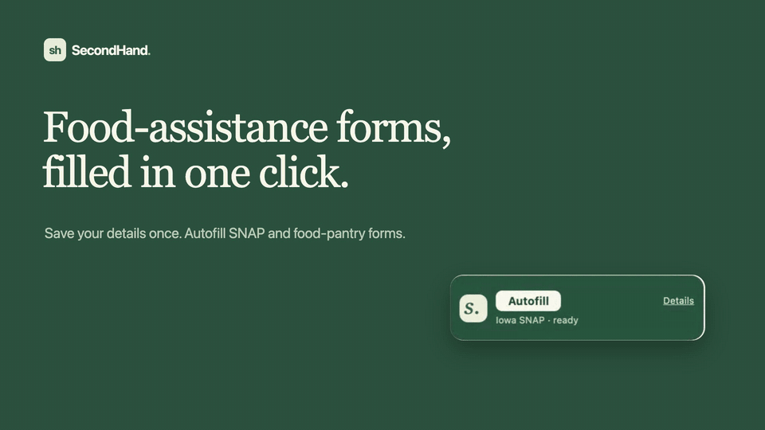

# secondHand

A desktop benefits companion and Chrome extension for Iowa SNAP. Your saved profile and application tracker live in an encrypted vault on your computer. On Iowa's Self-Service Portal, one **Autofill** click works through the application for you, through a local Chrome Native Messaging connection. It fills the questions it knows and continues past information-only screens. It stops with a plain instruction wherever you're needed: CAPTCHA, consent, missing answers, and unsupported steps. A Chrome side panel shows what still needs you.

**This is an early assisted-application release.** The initial applicant page has verified filling for names and suffix, phone/contact preferences, home and mailing addresses, and explicitly saved yes/no and program choices. One click also fills fields that your saved answers reveal, such as a mailing address. On the verified initial applicant page it chooses Save and Continue once required answers are complete. It also selects the first suggested home address on the verified home-only address screen and continues. Review the chosen address and every answer before submitting. On other pages, the general form engine may fill recognizable saved fields, but later navigation, unsupported questions, consent, signatures, and final submission stay manual. Only the government can confirm eligibility or approval. See [Iowa portal coverage](docs/iowa-portal.md) for the exact scope.



The demo uses the fictional test profile and a synthetic copy of Iowa's applicant page; nothing is submitted.

## iPhone app

A native SwiftUI iOS companion and Safari extension are in [`ios/`](ios/README.md). Open [`ios/SecondHand.xcodeproj`](ios/SecondHand.xcodeproj) in Xcode. It provides encrypted on-device storage, renewal reminders, and a guided application assistant with saved-answer filling, explicit page continuation, separately approved submission, and user-reported confirmation capture. This is a prototype; live Iowa filing and authenticated renewal remain unverified. The iPhone and desktop vaults are independent; there is no cross-device synchronization. See the [iOS setup guide](ios/README.md) and [application pipeline](ios/docs/Application-assistant.md).

## Android app

A matching Kotlin/Jetpack Compose app is in [`android/`](android/README.md). Open that folder in Android Studio. It includes encrypted offline profiles and documents, notice-based reminders, and an in-app Iowa assistant with explicit page and submission approval. It reuses the laptop and iOS form engines; supported WebViews run them in an isolated JavaScript world, with manual browsing on older providers. Live Iowa filing and authenticated renewal remain unverified. See the [Android setup guide](android/README.md) and [validation record](android/docs/Validation.md).

## Install on Windows or Mac

Download the Windows `.exe` installer or the Mac `.dmg` for your processor from the [secondHand download website](https://secondhand-download.khoidoan00.chatgpt.site). On Mac, drag SecondHand into Applications and launch it there before setting up Chrome. These pilot builds are unsigned and Mac builds are not notarized, so your operating system may warn or block them.

1. Open SecondHand and create a password. Save the recovery key it shows you somewhere safe, away from the computer. If you forget your password, choose **Forgot password?** and use that key, or reset it on the same computer if you left **Let this computer reset my password** on.
2. In **Chrome extension**, choose **Prepare Chrome extension**. The app prepares a permanent folder and registers its local connection automatically.
3. In Chrome, open `chrome://extensions`, enable **Developer mode**, choose **Load unpacked**, and select that folder. Use the app's **Copy folder path** button to locate it. No extension ID copying or command line is needed.
4. Save your profile, keep the app unlocked, and open [Iowa's portal](https://hhsservices.iowa.gov/apspssp/ssp.portal) in Chrome. Use Chrome 116 or newer. Start a guest application and click **Autofill** in the bottom-right corner. It stays on for that tab until you click **Stop**, lock SecondHand, leave Iowa's site, or reach a screen it doesn't know yet. The first time, the desktop app asks: choose **Allow once**, or **Always allow on this computer** to skip the pop-up whenever the app is unlocked. You can turn that off in the app's **Chrome extension** page.
5. The widget shows how many fields it filled and how many **need you**. Click that link to jump to each missing field. **Details** opens the side panel checklist (**Done**, **Needs you**, **Optional**, **Do it yourself**). The verified applicant and home-address screens can continue automatically; other Next buttons stay manual. Review every answer and the selected home address before submitting. Complete consent, signatures, and final submission yourself, and save the official confirmation in your local tracker. Locking the vault stops autofill.

Chrome installation still requires the manual Load unpacked step; the app does not silently install extensions. See [the complete setup and troubleshooting guide](docs/setup.md) for Mac folder selection, updates, and custom builds.

**Upgrading to 0.4:** install the new desktop app, choose **Refresh extension files**, click **Reload** for SecondHand at `chrome://extensions`, and reload your Iowa tab. If Chrome asks, review the updated permissions for the browser side panel and restricted Iowa site access. Avoid reloading an application containing unsaved answers—save or finish your current work first.

## Develop

Requires Node.js 22.12+ (Node 24 recommended) and npm. Packaged downloads target Windows and macOS (Apple silicon and Intel). The Windows build also uses the .NET Framework 4.x compiler included with supported Windows installations to compile the small native-messaging host from source.

```sh
npm ci
npm run check
npm test
npm start
```

For live reloading, run `npm run dev` (needs `npx playwright install chromium` once). It starts the desktop app and a separate Chromium window with the repository's `extension/` loaded. Edits to `renderer/` reload the app window, and edits to `desktop/` or `shared/` restart the app. Edits to `panel` files reload the widget and side panel in place. Other `extension/` edits reload the extension; refresh the Iowa tab yourself for content-script changes. The dev browser uses its own profile and copies Chrome's native bridge registration after you choose Prepare Chrome extension.

On macOS/Linux, use the desktop's Prepare Chrome extension button; it registers a development native-host launcher automatically. You can also load the repository's `extension/` directory directly: its manifest key pins the same ID. On Windows, build/install the `.exe` before connecting, because Chrome needs the packaged native relay. The desktop UI itself runs with `npm start` on either platform.

```sh
npm run test:ui       # Real Electron UI smoke test; needs a desktop session
npm run test:extension # Isolated Chromium with synthetic Iowa fixtures; install via npx playwright install chromium
npm run test:extension:video # Record a fictional-applicant walkthrough of the extension and native sidebar
npm run test:native   # Native protocol test (on Windows set SECONDHAND_PACKAGED_EXE to the built native host)
npm run extension:zip
npm run dist:win      # Run on Windows to build the NSIS .exe installer
npm run dist:mac      # Unsigned DMGs for Apple silicon and Intel Macs
```

Fictional QA data is in [`tests/fixtures/applicant-profile.json`](tests/fixtures/applicant-profile.json). Automated tests use it only in isolated browsers with all Iowa requests intercepted. The separately authorized manual live inspection is documented in [the journey record](docs/iowa-live-journey.md); it stopped at E-Signature without signing or submitting.
See [extension QA and recording](docs/extension-qa.md) for the walkthrough, test coverage, and simulated components.

This development branch also supports the observed home-only **Select Address** step: autofill chooses Iowa's first possible home-address match, then Save and Continue. Review that choice before submitting. Separate mailing confirmation, county questions, and later navigation remain manual. The general form engine can fill recognizable fields on other pages; this does not establish verified coverage of those pages. See [address confirmation coverage](docs/address-automation.md). The branch also fills the primary applicant’s saved birth date on the verified **Tell Us More** page; its other answers and Next stay manual. Public 0.4 downloads do not yet include these changes.

No application server, database service, API keys, or applicant account with secondHand is required.

## Local validation and releases

GitHub Actions CI workflows have been removed to avoid hosted-runner usage. Pull requests, pushes, and tags do not automatically run project checks, build installers, or create releases.

Run the local test and build commands in [Develop](#develop) before sharing changes. The [website](website/README.md), [iOS](ios/README.md), and [Android](android/README.md) guides retain their platform-specific validation instructions. Dependency audits can also be run locally with `npm audit` in the repository root and in `website/`.

Build installers locally with `npm run dist:win` on Windows or `npm run dist:mac` on macOS. Releases and installer uploads are manual. Publishing to the public download website uses a temporary upload token; see [`website/README.md`](website/README.md).

## Data boundaries

- The encrypted vault holds the profile, application notes, receipts entered as text, and deadlines. No cloud account, analytics, telemetry, remote fonts, or AI service is used by this code.
- The desktop app is the sole persistent owner of applicant data. Chrome extension storage and Chrome Sync are not used for applicant information.
- Filling a field shares it with Iowa's website. The website can read or autosave values before you click Submit, and ordinary **Save and Continue** saves page answers. Desktop approval occurs **before filling**, unless you chose **Always allow on this computer**. That setting lets the extension fill Iowa's supported page while the vault is unlocked. It never clicks Next and does not cover consent, signatures, or final submission.
- The extension is restricted to Iowa's supported HTTPS portal, requests only recognized fields on the current page, and never fills passwords, verification codes, signatures, or unknown household members.
- An encrypted backup is the portable copy of your information. A backup opens with the password or recovery key it was saved with. Keep backups off cloud-synced folders if you want all copies offline.
- This does not protect an unlocked computer from malware, malicious same-user processes, browser extensions reading Iowa's page, OS backups/crash dumps, or government-side storage. Read [the security design](docs/security.md).

## Project layout

| Directory | Purpose |
| --- | --- |
| `desktop/` | Electron main/preload, encrypted vault, native host, local IPC, registration |
| `renderer/` | Local desktop interface |
| `extension/` | Manifest V3 browser side panel, launcher, worker, and conservative Iowa adapter |
| `shared/` | Validated profile/application schema and portal allowlist |
| `tests/` | Crypto, protocol, schema, and portal-adapter regression tests |
| `scripts/` | Validation, real UI smoke test, extension packaging |
| `website/` | Public installer download site, setup guide, and authenticated release publishing |
| `ios/` | Native iPhone app, Safari extension, Xcode project, and iOS tests |

## Download website

The [public download website](https://secondhand-download.khoidoan00.chatgpt.site) serves Windows and Mac installers without requiring GitHub access. Its source is in [`website/`](website/README.md). Only software installers are hosted online; applicant information remains in the desktop vault. Website publishing credentials are never included in the app or browser bundles.

## Before broader distribution

Validate each supported page against the current live portal with a consenting applicant, then expand mappings with sanitized fixtures and regression tests. Review [portal coverage](docs/iowa-portal.md) before using real data. Test the installed native host on Windows with Chrome, obtain a code-signing certificate, and complete a security review. The bundled unpacked extension has a stable development ID. Publishing to the Chrome Web Store still requires a developer account, store package/identity coordination, and review; loading unpacked is the pilot path.

Official resources: [Iowa SNAP application instructions](https://hhs.iowa.gov/assistance-programs/food-assistance/snap/apply-snap), [Iowa Self-Service Portal](https://hhsservices.iowa.gov/apspssp/ssp.portal), [Chrome Native Messaging](https://developer.chrome.com/docs/extensions/develop/concepts/native-messaging).
