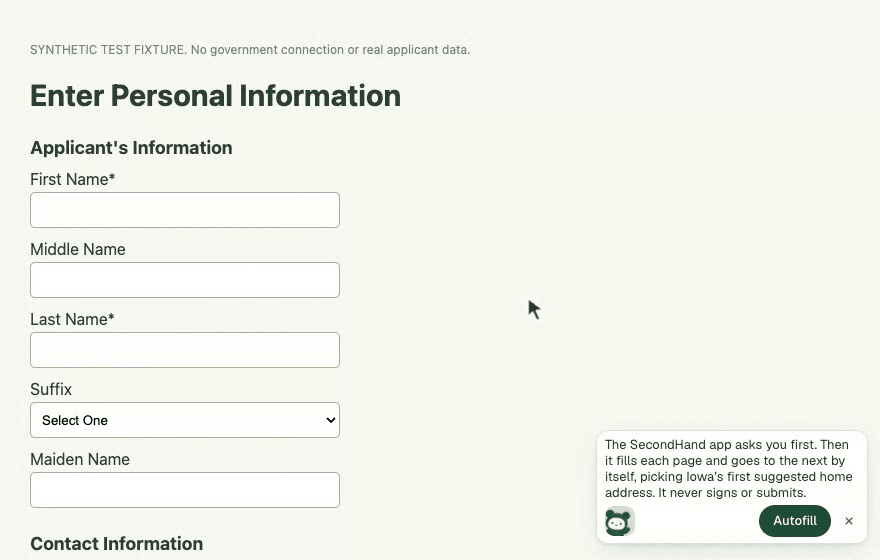
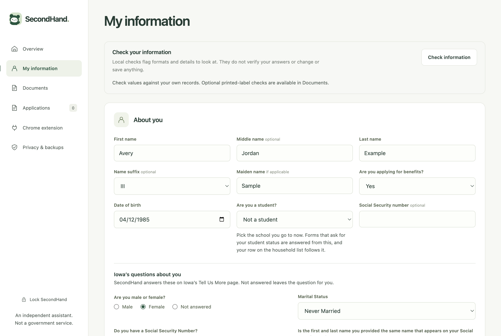
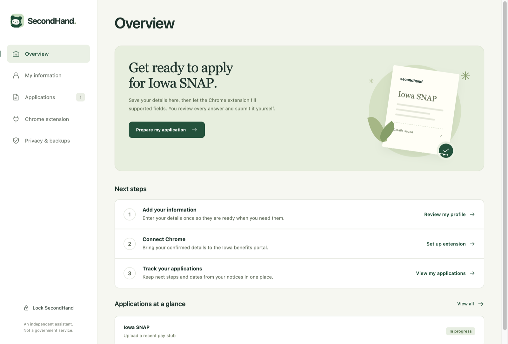
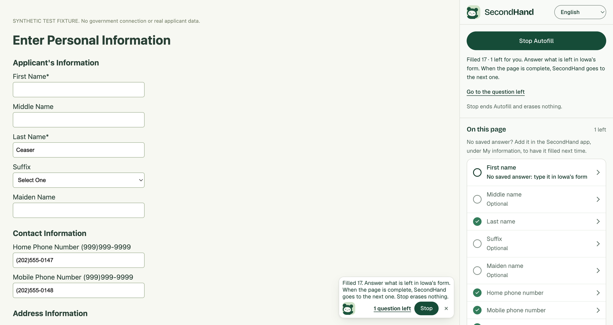
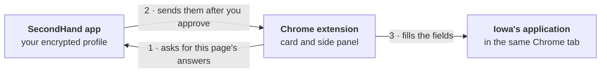
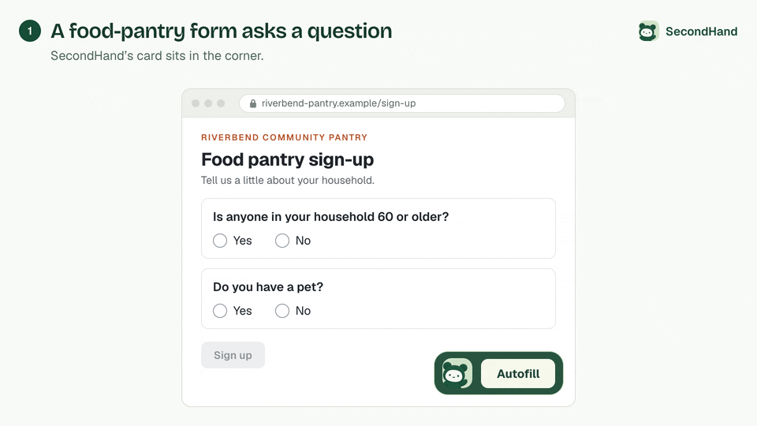

<p align="center">
  
</p>

<h1 align="center">SecondHand</h1>

<p align="center">
  <strong>A little help. A lot less typing.</strong><br>
  Save your details once, on your own computer. When you say yes, SecondHand fills in Iowa's SNAP application for you.
</p>

<p align="center">
  <a href="https://secondhand-download.khoidoan00.chatgpt.site"><strong>Download for Windows or Mac</strong></a>
  &nbsp;·&nbsp; <a href="docs/setup.md">Setup guide</a>
  &nbsp;·&nbsp; <a href="docs/iowa-portal.md">What it covers</a>
  &nbsp;·&nbsp; <a href="#local-ai-with-laya">Local AI</a>
  &nbsp;·&nbsp; <a href="docs/security.md">Security</a>
  &nbsp;·&nbsp; <a href="#develop">Develop</a>
</p>

<p align="center">
  
  <br>
  <sub>A fictional applicant on a synthetic copy of Iowa's form. Nothing is sent anywhere.</sub>
</p>

> [!IMPORTANT]
> SecondHand is an early pilot. It is independent software, not part of Iowa HHS, and it does not decide who qualifies. It fills in and checks answers; you review them, sign, and submit.

## What it does

- **Keeps your details on your computer.** Your profile and application notes are saved in an encrypted file that only your password or recovery key opens. There is no account, no cloud copy, and no analytics.
- **Sets up in about five minutes.** Right after you create your password, a short guided setup walks you through six steps: you (with whether you're a student), your household, where you live, income and money on hand (with where it comes from), programs (with the benefits your household gets now and the help you're looking for), and Iowa's questions about you. Each step is saved as you go. Skip it, or stop part way, and finish it later from Overview.
- **Knows your household.** List the people you live with once, with their birth dates. SecondHand works out the counts forms ask for, such as "How many people 0–17?", "18–59", or "60 and older", and fills a student's name and grade when one person on the list is a student. It never guesses a guardian's name.
- **Answers pantry sign-up questions.** "Student status", "Assistance needed", "Source of income" and "Do you or anyone in your family receive cash assistance?" are answered from what you saved. SecondHand checks an option only when it's the one option that matches an answer you saved. When one of your answers matches several options, such as On-Campus Job and Off-Campus Job for a job, it leaves those for you and the question stays under **Needs you**.
- **Helps prepare later questions.** **My information → More SNAP information** keeps jobs, expenses, property, household details, and reviewed historical tax references locally. Saving a detail does not automatically map a later portal page. See [SNAP preparation and tax-document coverage](docs/snap-information.md).
- **Fills Iowa's application in one click.** Click **Autofill** in the corner of Iowa's portal. SecondHand fills the questions it knows, moves past screens that only give information, and stops wherever you're needed.
- **Shows what still needs you.** A yellow **1 need you** link jumps to each missing answer. Click the SecondHand logo on the card to open Chrome's side panel, which marks every question on the page as **Done**, **Needs you**, **Optional**, or **Do it yourself**.
- **Saves what you type for next time.** When Autofill finds a question it knows but you hadn't saved an answer for, answer it on the page and click **Save to My information** in the side panel. SecondHand reads that one answer only after your click, and the app asks before it saves it.
- **Answers the questions the rules miss.** Laya, a small AI model that runs inside the desktop app, picks an answer from your saved facts when it's confident, and marks it as a guess for you to check. When it isn't sure, or your facts don't say, it leaves the question for you.
- **Leaves the decisions to you.** The app asks before sharing anything, unless you choose **Always allow**. CAPTCHA, consent, signatures, and final submission are always yours.
- **Speaks your language.** The side panel works in English, Spanish, Vietnamese, Chinese, French, and Arabic. It can show Iowa's questions in your language and sum up long pages, using Chrome's built-in translator and summarizer on your computer.
- **Recognizes forms across websites.** Choose **Use SecondHand on all websites** in Chrome's side panel, or turn on individual HTTPS sites. **Autofill** fills one page. The optional **Fill and continue** mode uses saved answers only and can click ordinary Next or Continue while the form is complete and recognized; it stops for missing answers, unsupported controls, review, consent, signatures, payments, and final submission. Continuing may send or save the page's answers.
- **Reuses your custom answers.** Under **My information → Custom answers**, save up to 50 recurring question labels and answers, with optional exact aliases. After **Autofill**, when you answer a question it left open, the side panel offers **Remember for next time** beside it: checked by default, unchecked for answers that change, such as dates, pickup times, or "this week". Click **Remember checked answers**, and the app asks before it keeps them as custom answers, with the site they came from. An answer saved this way fills only the same question, in the same kind of box, with the same choices. These answers are encrypted with your profile and never supplied to Laya. Those about a sensitive subject, such as income, health, citizenship, or a date of birth, wait for **Fill sensitive details** unless you chose Always allow; the others fill like the rest of your saved answers. The extension supports native controls, open shadow roots, editable text boxes, and compatible ARIA choices; it cannot handle every form.

## See it

| Your saved details, in the desktop app | The overview |
| --- | --- |
|  |  |

**On Iowa's portal, with Chrome's side panel open.** The card in the corner says one answer still needs you; the side panel shows which one.



## How it works



The desktop app is the only place your details are kept. The Chrome extension talks to it through Chrome's native messaging, a direct connection between the two programs on your computer; nothing goes through a server. For each page, the extension asks only for the answers that page needs, and only while the app is unlocked. Filling a field on Iowa's page shares that answer with Iowa, as typing it would. Read more in [the security design](docs/security.md).

## Read documents locally

Open **Documents** in the unlocked desktop app to read a PDF, PNG, or JPEG on your computer. English OCR is bundled with the app: no upload, OCR account, model download, or separate program is needed. It accepts files up to 30 MiB and PDFs up to 12 pages.

For recognizable 1040/1040-SR, W-2, SSA-1099, and 1099-NEC layouts, review suggested applicant details and historical amounts against the original. Combined names remain for manual review, and a 1099-NEC recipient TIN is never assumed to be an SSN. Choose which details to put in your profile draft, then review **My information** and click **Save my information**. SSNs, other taxpayer identifiers, and tax amounts are omitted when two OCR passes disagree. Tax-year amounts, ambiguous names, and spouse/dependent details are for review only; they never become current income, household answers, or eligibility decisions automatically. Other documents show extracted text without tax-form suggestions.

Employer and payer details appear separately for review. You can explicitly add a [historical tax reference](docs/snap-information.md#keep-an-optional-historical-reference) to your unsaved draft, then save it with your profile. That record contains no SSN, EIN, copied document, or raw OCR text, and never creates a current job or monthly-income answer.

**Check information** reviews the profile draft for format issues and conflicting answers. Extracted document fields are also checked locally. Optional experimental Laya feedback can flag a printed document label mapped to an unexpected field; it receives labels, not your values, and never verifies or corrects a value. [Local field review](docs/field-review.md) explains the statuses and limits.

The original stays in place. SecondHand keeps no document database or copied original, and clears temporary review text when you discard it, leave Documents, or lock the app. This feature is in source; availability in a public installer is separate. See [local document reading](docs/document-ocr.md) for limits and QA scope.

## Local AI with Laya

<p align="center">
  
  <br>
  <sub>A fictional applicant on a made-up pantry form. The scores are the real model's.</sub>
</p>

Rules fill the questions SecondHand knows. For the rest, the desktop app asks Laya:

1. **The extension reads the question and its options** from the page: labels only, never your saved answers.
2. **The desktop app writes your saved profile as plain facts**, such as "The household has 1 person", on your computer.
3. **Laya scores every option.** For each one it answers a single yes/no question: given the facts about the household, is this the correct answer to the form question? "None of these, or the facts don't say" is scored too.
4. **It fills only a sure answer**, one that scores over 0.9 and beats "None of these". The answer gets a dashed amber outline and the summary says it was suggested by Laya, so you know to check it. On sites other than Iowa's portal, the app asks before it uses sensitive details such as your age, unless you chose **Always allow**.
5. **It doesn't fill a best guess.** Laya can pick its top-scoring option for a question it isn't sure of, but on 15 real forms it never trained on those guesses were mostly wrong (round 2's model got 0 of 4 right, round 4's 2 of 8), so Autofill doesn't ask for them. `ML_model/eval/app_accuracy.cjs` still measures them for future models.
6. **Otherwise the question stays yours**, marked **Needs you** in the side panel.

Laya also matches text boxes the rules don't recognize to the saved detail they ask for, such as a differently worded name or phone field. On other websites, **Fill and continue** uses saved rule matches and exact custom answers only; neither Laya nor Chrome's AI guesses during that mode.

Laya is [fine-tuned](docs/laya-model.md) from the open [Laya](https://huggingface.co/convaiinnovations/laya) model and published at [huggingface.co/JacobTDang/secondhand-laya](https://huggingface.co/JacobTDang/secondhand-laya) under Apache-2.0. It is free and needs no account. The app downloads it (about 429 MB) in the background the first time it opens, checks for a newer version once a day, and runs it on the computer's processor, about a tenth of a second per option on a recent Mac. Your details never leave your computer: Laya's only network traffic is downloading the model and checking for a new one. To turn Laya off, use its switch in the app's **Chrome extension** view. It runs on Windows and on Macs with Apple silicon; Intel Macs show it as unavailable.

## Get started

1. **Install.** [Download](https://secondhand-download.khoidoan00.chatgpt.site) the Windows `.exe` or the Mac `.dmg` for your chip. On a Mac, drag SecondHand into Applications and open it from there. These pilot builds are unsigned, so your computer may show a warning first.
2. **Create a password.** Save the recovery key the app shows you somewhere safe, away from the computer. If you ever forget your password, choose **Forgot password?** and use that key, or reset it on the same computer if you left that option on. With neither, **Start over** erases the saved information so you can make a new password.
3. **Add the extension to Chrome.** In the app, open **Chrome extension** and click **Prepare Chrome extension**. In Chrome, go to `chrome://extensions`, turn on **Developer mode**, click **Load unpacked**, and choose the folder the app prepared (**Copy folder path** helps you find it). You only do this once.
4. **Apply.** Keep SecondHand unlocked and open [Iowa's portal](https://hhsservices.iowa.gov/apspssp/ssp.portal) in Chrome 116 or newer. Start your application and click **Autofill** in the bottom-right corner. The first time, the app asks: choose **Allow once**, or **Always allow on this computer**.
5. **Finish it yourself.** Click **need you** to jump to anything missing. Review every answer, including the home address SecondHand picked. Then do the consent, signatures, and submission, and save Iowa's confirmation number under **Applications** in the app.

The [setup guide](docs/setup.md) covers each step in detail, including how to find the folder on a Mac and what to do when something goes wrong.

<details>
<summary><strong>Updating from an earlier version</strong></summary>

Install the new app and open it. The next time you use the extension, SecondHand refreshes its files and reloads itself in Chrome, once nothing is filling. The side panel then says it was updated. Reload any form page that was open, after you save or finish it, so reloading doesn't lose unsaved answers. Keep **Developer mode** on at `chrome://extensions`, or Chrome turns SecondHand off.

Coming from a version without automatic updates, such as the public 0.4 downloads, do it by hand once: open **Chrome extension** in the app and click **Refresh extension files**, then click **Reload** for SecondHand at `chrome://extensions` and reload your Iowa tab. If Chrome asks, review the updated permissions.

</details>

## What it covers today

Autofill works screen by screen and stays on for the tab until you click **Stop**, lock SecondHand, leave Iowa's site, or reach a screen it doesn't know. It also stops after 64 automatic steps so you can check where you are.

| Iowa screen | What SecondHand does |
| --- | --- |
| Household Application Information | Picks **Yes** when one of your saved programs is a clear yes. You solve the CAPTCHA and continue. |
| Before You Start, Important Information, Instructions | Clicks Continue for you. These screens send no answers. |
| Let's get started, About you | Waits for you to accept Iowa's consent or click Continue. |
| **Enter Personal Information** | Fills your saved names, phones, home and mailing addresses, and program choices. Waits for missing required answers, then clicks Save and Continue. |
| Select Address (verified home-only layout) | Picks Iowa's first suggested home address and continues. Check it before you submit. |
| Tell Us More | Fills matching saved answers. The fully captured layout can continue only when all visible questions are recognized and answered, any submitted SSN matches, and no errors or dialogs remain. The partial birth-date layout stays manual. |
| Captured screening pages | Emergency, Background Information, Job Information, Income Information, Expenses Information, and Property Information use explicit saved answers and may continue only when every visible question is supported and complete. |
| Captured financial records | One explicitly owned job, Private Pension/Social Security income, rent responsibility, personal utility record, or Cash/Uncashed Check asset. You choose among matching saved records; required fields and page guards must be complete before Continue. No annual-to-current income conversion. |
| Other Iowa pages | May fill matching saved answers after you approve, and Laya's answers to other questions, marked as guesses. You continue. Captured screening and financial record forms have the separate scope below; unmatched variants still need you. |
| CAPTCHA, consent, signatures, final Submit | Never touched. |

The Select Address and Tell Us More steps and Laya are in this code but not yet in the public 0.4 downloads. SecondHand never changes an answer already on the page, and any answer Laya picks is marked as a guess for you to check. [Portal coverage](docs/iowa-portal.md) has the exact field list.

## How a new form gets supported

- **Iowa's portal pages are mapped by hand.** [`extension/iowa-adapter.js`](extension/iowa-adapter.js) knows a small set of Iowa's pages by their headings, form, and control ids. Each page came from a consented live walk-through of the portal ([the walk-through log](docs/iowa-live-journey.md)) and is kept as a sanitized copy in [`tests/fixtures`](tests/fixtures). The later scalar and record adapters add their own captured page guards. Only recognized variants get automatic **Continue** or **Save and Continue**; summaries, Add Another, household relationships, Other Information/legal/representative questions, and final review remain manual. Adding another Iowa page means another live check, a fixture, code, and tests.
- **A known Iowa page that looks different fills nothing.** If a mapped page changes so it no longer matches what was checked, SecondHand asks the app for nothing, fills nothing, and doesn't hand the page to the general rules. The page is left to you. [`tests/extension-navigation.test.cjs`](tests/extension-navigation.test.cjs) checks this ("strict rejected pages cannot use the general engine").
- **Other forms need no code of their own.** Other Iowa pages, and food-assistance sites you turn on in the side panel, use the general rules in [`extension/generic-adapter.js`](extension/generic-adapter.js). They read each box's label, autocomplete hint, and accessible name, fill only the boxes they recognize, never change an answer already there, and never navigate or submit. [`scripts/smoke-all-websites.cjs`](scripts/smoke-all-websites.cjs) checks this on a made-up pantry form with no site code: the boxes the rules know get filled, nothing is submitted, and the page doesn't change.
- **Laya answers some of what the rules miss, as a guess.** Laya runs on this computer. When the rules don't know a question, Laya may pick an answer from your saved facts. SecondHand marks each of Laya's answers as a guess for you to check, because Laya is sometimes wrong. On 15 real forms collected after training, which nobody wrote code for ([Final holdout](docs/laya-model.md#final-holdout)):
  - Choosing answers: 5 of the 72 answers Laya filled were wrong. 57 matched the answer key, and 10 more were right by the saved facts.
  - Matching text boxes, the way the app asks: 8 of the 67 boxes Laya matched were wrong, and 59 were right. Laya matched 59 of the 81 boxes it could have.
  - These counts are Laya's sure answers, the only ones Autofill fills. Its best guesses were mostly wrong, so Autofill doesn't ask for them (step 5 of [Local AI with Laya](#local-ai-with-laya)).
- **With Laya off, the rules still work.** The rules always fill first, and Laya only gets what's left. Turn Laya off with its switch in the app's **Chrome extension** view, and SecondHand doesn't run it at all. See [Local AI with Laya](#local-ai-with-laya).

On a form SecondHand has no map for, some questions stay with you. When the rules don't recognize a question and Laya has no sure answer for it, SecondHand leaves it for you to answer.

## Privacy and safety

- **Your details stay in the desktop app.** Chrome's extension storage and Chrome Sync never hold applicant information.
- **Nothing is filled without your yes.** The app asks before filling unless you chose **Always allow on this computer**, which you can turn off on its **Chrome extension** page. That choice covers sensitive details too, such as your Social Security number, date of birth, income, benefits, and citizenship and disability answers, on every site SecondHand is on. Locking the app, by hand or after 10 idle minutes, stops autofill.
- **The extension stays in its lane.** It only runs on Iowa's secure portal and on sites you turn on, one at a time or all at once. It fills nothing until you click **Autofill**, asks only for fields it recognizes on the current page, and never fills passwords, verification codes, signatures, or unknown household members. On every site but Iowa's, the pop-up for sensitive details such as your Social Security number, date of birth, income, and the benefits your household gets also offers **Always allow on this site**, which skips it on that site alone; the app lists those sites, each with **Remove**. Household counts, such as how many people are 0 to 5, are ordinary answers. **Save to My information** never reads a password, code, signature, or Social Security number box. Turn all websites off in the side panel or on the app's **Chrome extension** page: nothing runs on other sites after that, and the app refuses sites you haven't trusted. Chrome keeps listing the access you gave it until you remove it in Chrome's extension settings; Iowa's portal isn't affected.
- **Iowa sees what's on its form.** Iowa's site can read or save answers as they're entered, and Save and Continue sends the page's answers to Iowa.
- **Laya runs on this computer.** Laya, SecondHand's AI model (about 429 MB), is on unless you turn it off in the **Chrome extension** view. While it's on, SecondHand downloads it in the background, checks Hugging Face for a newer version once a day, and runs it locally. No profile data is sent anywhere. See [Local AI with Laya](docs/security.md#local-ai-with-laya).
- **Backups are yours to keep.** An encrypted backup opens with the password or recovery key it was saved with. Keep it out of cloud-synced folders if you want every copy offline.
- **An unlocked computer is still a computer.** SecondHand can't protect against malware, other programs running as you, other browser extensions reading Iowa's page, or system backups. See [the security design](docs/security.md).

## Other platforms

| | Folder | Status |
| --- | --- | --- |
| **iPhone app and Safari extension** | [`ios/`](ios/README.md) | Prototype. Encrypted storage on the phone, renewal reminders, and a guided application assistant with separate approval to submit. |
| **Android app** | [`android/`](android/README.md) | Prototype. Encrypted profiles and documents, notice-based reminders, and an in-app Iowa assistant. |

The phone apps keep their own encrypted data; nothing syncs between devices. Live Iowa filing from the phone apps is not yet verified.

## Develop

Requires Node.js 22.12 or newer (24 recommended) and npm. No server, database, API keys, or SecondHand account is involved.

```sh
npm ci
npm run check
npm test
npm start
```

For live reloading, run `npm run dev` (run `npx playwright install chromium` once first). It opens the desktop app and a separate Chromium with this repository's `extension/` loaded:

- edits to `renderer/` reload the app window;
- edits to `desktop/` or `shared/` restart the app;
- edits to the `panel` files reload the card and side panel in place;
- other `extension/` edits reload the extension. Refresh the Iowa tab yourself for content-script changes.

| Command | What it does |
| --- | --- |
| `npm start` | Runs the desktop app. |
| `npm run dev` | Runs the app and a Chromium with the extension, reloading on edits. |
| `npm test` | Unit tests: encryption, messaging, schema, portal adapters, and the extension's panels. |
| `npm run check` | Syntax checks, the extension's permission rules, and a newer `BUILD` (in `extension/background.js` and `extension/panel.js`) whenever `extension/` changed since main. |
| `npm run test:coverage` | Unit tests with Node's coverage; fails when `desktop/main.cjs`, `extension/background.js`, `extension/panel.js`, `extension/content.js`, `renderer/app.js` or all files fall under their floor in `scripts/coverage.cjs`. |
| `npm run test:ocr` | Exercises bundled offline OCR on a generated synthetic image; pass `-- --input tests/fixtures/ocr/synthetic-1040sr.pdf` for the tax-form sample. |
| `npm run test:ocr:ui` | Reads the synthetic tax form in the desktop app and verifies review, draft merging, encrypted saving, and lock/unlock. |
| `npm run test:ui` | Drives the real Electron app end to end. Needs a desktop session. |
| `npm run test:extension` | Runs the extension in an isolated Chromium against synthetic Iowa pages. |
| `npm run test:translation` | Checks the language picker, translated questions, and right-to-left Arabic. |
| `npm run test:summary` | Checks the side panel's "What this page says". |
| `npm run test:laya` | Checks Laya's fills on a synthetic pantry form, with the desktop app stubbed. |
| `npm run test:extension:video` | Records a walkthrough with a fictional applicant. |
| `npm run test:native` | Tests the native messaging protocol. On Windows, set `SECONDHAND_PACKAGED_EXE` to the built host. |
| `npm run extension:zip` | Packages the extension. |
| `npm run dist:win` / `npm run dist:mac` | Builds the Windows installer or the Mac DMGs (Apple silicon and Intel). |
| `npm run release:checksums` | Writes SHA-256 checksums for the installers and extension zip in `release/`. |

<details>
<summary><strong>Connecting Chrome while developing</strong></summary>

On macOS and Linux, click **Prepare Chrome extension** in the app; it registers a development launcher for the native connection. You can also load this repository's `extension/` folder directly, since its manifest key pins the same extension ID. On Windows, build and install the `.exe` first: Chrome needs the packaged native relay, which is compiled with the .NET Framework 4.x compiler that ships with Windows.

To rebuild every app icon from `website/public/brand/secondhand-mascot.png`, run `swift scripts/generate-icons.swift` on a Mac.

</details>

Tests only use the fictional profile in [`tests/fixtures/applicant-profile.json`](tests/fixtures/applicant-profile.json), in isolated browsers with every Iowa request blocked. A separately authorized check on the live portal is written up in [the journey record](docs/iowa-live-journey.md); it stopped at E-Signature without signing or submitting. [Extension QA](docs/extension-qa.md) explains the recorded walkthrough and what is simulated.

### Releases

Hosted CI workflows have been removed. Run `npm test` and `npm run check` locally, plus `npm test`, `npm run typecheck`, `npm run lint` and `npm run build` in `website/` when changing the website. Run the Electron, browser, OCR, Laya and iOS checks your change touches before merging (`test:ui`, `test:extension`, `test:translation`, `test:summary`, `test:laya`, `test:ocr`, `test:ocr:ui`, `test:native`, and the [iPhone app's tests](ios/README.md)). The [QA gate list](.claude/agents/qa.md) says which ones each area needs. Tags don't build installers, and nothing runs dependency audits: run `npm audit` in the root and in `website/`. Installers are built locally with `npm run dist:win` on Windows or `npm run dist:mac` on a Mac, and uploaded by hand. The [download website](website/README.md) explains publishing, which uses a temporary upload token that never ships in the app.

## Project layout

| Folder | What's inside |
| --- | --- |
| `desktop/` | Electron main process, encrypted storage, native messaging host, and Chrome registration |
| `renderer/` | The desktop app's interface |
| `extension/` | The Chrome extension: on-page card, side panel, background worker, and Iowa adapter |
| `shared/` | Profile and application schema, and the portal allowlist |
| `tests/` | Unit tests and fictional fixtures |
| `scripts/` | Checks, smoke tests, recordings, and packaging |
| `website/` | The download website and its release publishing |
| `docs/` | Setup, coverage, security, and design notes |
| `ios/`, `android/` | Phone app prototypes |
| `ML_model/` | Training data and evaluation for Laya, the local AI model |

## Documentation

- [Detailed application guides](docs/applications/README.md): high-level usage and low-level implementation for Windows EXE, Mac DMG, iOS, Android, and the website

- [Set up SecondHand](docs/setup.md): installing, adding the extension, applying, and troubleshooting
- [Iowa portal coverage](docs/iowa-portal.md): exactly which fields and screens are supported
- [Home-address confirmation](docs/address-automation.md): how the Select Address step works
- [Local document reading](docs/document-ocr.md): offline OCR, review before saving, limits, and synthetic QA
- [Security and privacy design](docs/security.md): encryption, the native connection, and limits
- [Laya model card](docs/laya-model.md): how the local AI model was trained, how accurate it is, and how new versions are published
- [Extension QA](docs/extension-qa.md): test coverage and the recorded walkthrough
- [Iowa guest-draft journey](docs/iowa-live-journey.md): the authorized live-portal check
- [Implementation contract](docs/implementation-contract.md): internal rules the code keeps
- [Mascot](docs/secondhand-mascot.md) and [website design notes](docs/react-bits-design-research.md)

## Before wider release

Each supported page still needs checking against the live portal with a consenting applicant, with new mappings backed by sanitized fixtures and tests. The Windows native host needs testing with Chrome on real installs, the builds need a code-signing certificate, and the project needs a security review. Loading the extension unpacked is the pilot path; the Chrome Web Store needs a developer account, store packaging, and review.

---

<sub>Independent software, not affiliated with Iowa HHS. Using SecondHand does not determine eligibility. Official resources: [How to apply for Iowa SNAP](https://hhs.iowa.gov/assistance-programs/food-assistance/snap/apply-snap) · [Iowa's Self-Service Portal](https://hhsservices.iowa.gov/apspssp/ssp.portal) · [Chrome native messaging](https://developer.chrome.com/docs/extensions/develop/concepts/native-messaging)</sub>
