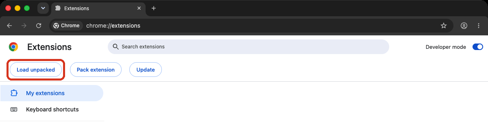
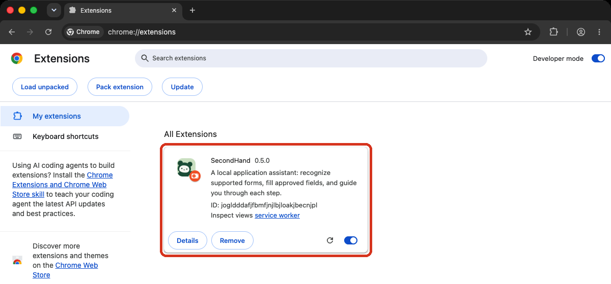
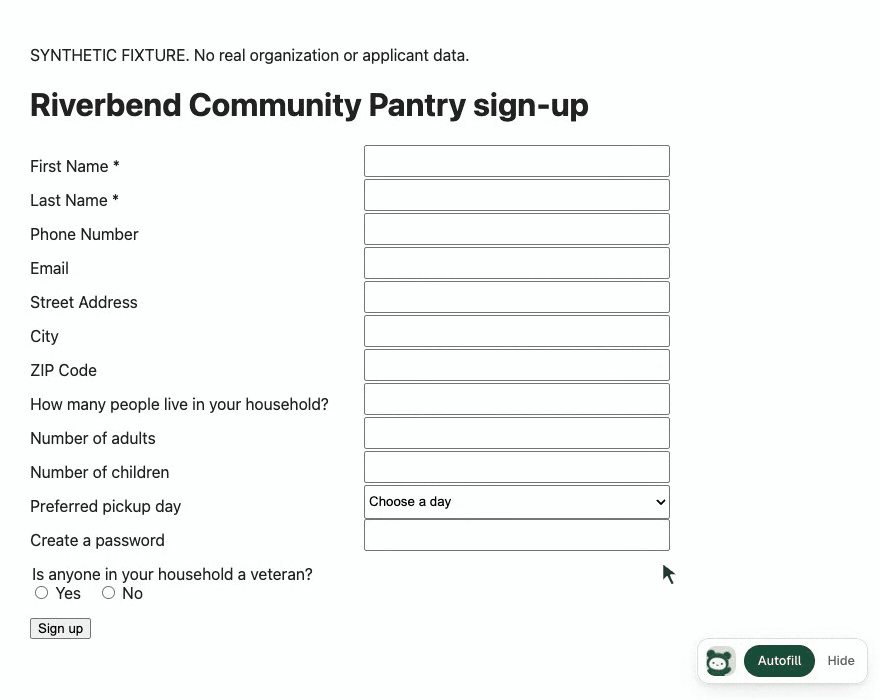
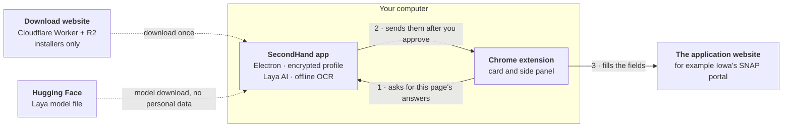

<p align="center">
  
</p>

<h1 align="center">SecondHand</h1>

<p align="center">
  <strong>Enter your details once. Fill benefit applications in one click. Your details are stored only on your own computer.</strong>
</p>

<p align="center">
  <a href="https://secondhand.ethanpam.workers.dev"><strong>Download SecondHand 0.5.1</strong></a>
  &nbsp;·&nbsp; <a href="#get-started">Get started</a>
  &nbsp;·&nbsp; <a href="#user-guide">User guide</a>
  &nbsp;·&nbsp; <a href="#if-something-goes-wrong">Help</a>
  &nbsp;·&nbsp; <a href="#try-it-with-a-sample-applicant">Try a sample</a>
  &nbsp;·&nbsp; <a href="CONTRIBUTING.md">Contribute</a>
</p>

<p align="center">
  Free and open source (MIT) &nbsp;·&nbsp; Windows and Mac &nbsp;·&nbsp; No account, no cloud, no analytics &nbsp;·&nbsp; Built for <a href="#why-it-matters">Hack Away Hunger 2026</a>
</p>

> [!IMPORTANT]
> SecondHand is an early pilot. It is independent software, not part of Iowa HHS, and it does not decide who qualifies. It fills in and checks answers; you review them, sign, and submit.

## Contents

1. [What is SecondHand?](#what-is-secondhand)
2. [Why it matters](#why-it-matters)
3. [What it does today](#what-it-does-today)
4. [Get started](#get-started)
5. [User guide](#user-guide)
6. [If something goes wrong](#if-something-goes-wrong)
7. [Privacy and safety](#privacy-and-safety)
8. [Try it with a sample applicant](#try-it-with-a-sample-applicant)
9. [How a new form gets supported](#how-a-new-form-gets-supported)
10. [Tech stack and architecture](#tech-stack-and-architecture)
11. [What it costs to run for a year](#what-it-costs-to-run-for-a-year)
12. [Roadmap](#roadmap)
13. [For developers](#for-developers)
14. [License and credits](#license-and-credits)

## What is SecondHand?

SecondHand is a free program that helps people fill out benefit applications, starting with Iowa's SNAP application (food assistance, sometimes called food stamps).

It comes in two parts that work together:

| Part | What it does |
| --- | --- |
| **The SecondHand app** for Windows and Mac | You type your details once: your name, address, phone, the people you live with, income, and so on. The app keeps them in an encrypted file on your own computer, locked with your password. |
| **The SecondHand Chrome extension** | When you open an application in Chrome, a small SecondHand card appears in the corner. Click **Autofill** and it fills in the questions it knows from your saved details, then shows you what still needs you. |

Think of it like a password manager, but for the questions every assistance form asks. Nothing goes to a SecondHand server, because there isn't one. You stay in charge: the app asks before it shares anything, and you always review, sign, and submit yourself.

<p align="center">
  
  <br>
  <sub>A fictional applicant on a synthetic copy of Iowa's form. Nothing is sent anywhere.</sub>
</p>

## Why it matters

**The problem.** When a family needs help with food, rent, or utilities, they usually have to apply to several programs. Each one has its own website and its own forms, and nearly all of them ask the same questions: who you are, where you live, who lives with you, and what you earn. Then many programs ask again at renewal time. Agencies keep separate systems that don't share information, so the work of copying the same answers falls on the person who has the least time to spare.

<p align="center">
  
  <br>
  <sub>An illustration with a fictional applicant. SecondHand fills supported fields; you check every answer.</sub>
</p>

**Why it's worth solving.** At the Hack Away Hunger kickoff panel in September 2026, Iowa's food-security leaders named the same gap again and again:

- *"The scarcest resource for people in need is time, not money."* (Matt Unger, former CEO of DMARC)
- The Iowa Food Bank Association's SNAP hotline has 5 staff answering about 260 calls a day and helping with about 1,000 applications a month.
- FindHelp saw about 1 million searches for services in Iowa in the past year, and 24% of them were for food.
- The average Iowa SNAP benefit is about $170 per person per month: real help that people miss out on when the paperwork is too much.

The panel's number one technology wish was a **single point of entry**: a "passport" where a person enters their information once and it fills in everywhere, the way MyChart works for health records. They also set clear limits: protect privacy and dignity, keep costs near zero, don't make AI a critical dependency, and don't ask agencies to change their systems.

**How SecondHand answers that.**

| What the panel asked for | What SecondHand does |
| --- | --- |
| One place to enter information once | A saved profile on your computer fills supported forms in one click |
| Less paperwork and fewer repeated visits | No retyping the same answers; saved notes and dates for each application |
| Privacy and dignity for vulnerable people | Everything stays on your computer, encrypted; no account, no analytics |
| Low-cost and sustainable | $0 a year to run today ([see the costs](#what-it-costs-to-run-for-a-year)) |
| AI is optional, never required | Plain rules do the filling; the small local AI model can be switched off |
| No changes needed from agencies | Works on the existing websites as they are |
| Keep the human connection | Removes copying, so caseworkers and navigators can spend time on people |

SecondHand was built for **Hack Away Hunger**, the DSMHack / CharityHack 2026 hackathon in Des Moines on food insecurity in Iowa.

## What it does today

Version **0.5.1**, released October 10, 2026 ([release notes](docs/releases/0.5.1.md)).

- **Keeps your details on your computer.** Your profile and application notes are in an encrypted file that only your password or recovery key opens. There is no account, no cloud copy, and no analytics.
- **Knows your household.** List the people you live with once. SecondHand works out the counts forms ask for, such as "How many people 0 to 17?", and never guesses a guardian's name.
- **Fills Iowa's SNAP application screen by screen.** It fills what it knows, moves past screens that only give information, and stops wherever you're needed. Iowa's security check (the CAPTCHA), consent, signatures, and final submission are always yours.
- **Works on other forms too.** Turn SecondHand on for any secure website, such as a food pantry's sign-up form. It reads each question's label and fills only the ones it recognizes.
- **Speaks your language.** The side panel works in English, Spanish, Vietnamese, Chinese, French, and Arabic. It can show a form's questions in your language and sum up long pages in plain words, using Chrome's built-in translator and summarizer on your computer.
- **Answers food pantry sign-up questions (new in 0.5.1).** Questions such as "Student status", "Assistance needed", "Source of income", "Sex" or "Gender" are answered from what you saved, but only when exactly one option matches. Otherwise the question stays with you.
- **Fills in today's date (new in 0.5.1).** Pantry questions such as "Date ordered", "Date of visit" and "Today's date" get today's date from your computer's calendar. Never a birth, start, move-in, due or end date, and never on Iowa's application.
- **Library mode for shared computers (new in 0.5.1).** On a library or community computer, SecondHand can delete its local data after two minutes without activity.
- **Remembers your own answers.** When you answer a question SecondHand didn't know, it offers to remember it for next time, with your permission. Up to 50 custom answers, encrypted with your profile.
- **Fill and continue.** On recognized multi-page forms, it can fill and click ordinary **Next** buttons, and stops for anything missing, consent, signatures, payments, or submission.
- **Reads your documents on your computer.** Open a PDF or photo of a tax form such as a W-2 or 1040, and SecondHand reads it with offline text recognition and suggests details for you to review. Nothing is uploaded.
- **Answers some questions the rules miss, only when it's sure.** Laya, a small AI model that runs inside the app, picks an answer from your saved facts only when it's confident, outlines it, and the side panel says it was suggested by Laya, for you to check. It runs on Windows and Apple-silicon Macs, and you can turn it off.

## Get started

You need a Windows PC or a Mac, and **Google Chrome 116 or newer**. Setup takes about ten minutes, once.

### 1. Install the app

[Download SecondHand](https://secondhand.ethanpam.workers.dev) for Windows, or the Mac version for your chip (Apple silicon for M1 and later, Intel for older Macs).

- **Windows:** run the `.exe` installer, then open SecondHand.
- **Mac:** open the `.dmg`, drag SecondHand into **Applications**, and open it from there. Keep it in Applications, because Chrome connects to the app where it is.

These pilot builds are unsigned, so Windows or macOS may show a warning first. Signed installers are on the [roadmap](#roadmap).

### 2. Create your password

Choose a password of at least 12 characters. SecondHand then shows a **recovery key** once: copy it, save it to a file, or write it down, and keep it away from the computer. If you forget your password, **Forgot password?** on the unlock screen takes the recovery key. There is no online password reset, because there is no online account.

### 3. Add the extension to Chrome

The extension isn't in the Chrome Web Store yet, so you add it yourself, once:

1. In the app, open **Chrome extension** and click **Prepare Chrome extension**. The app saves the extension in a folder on your computer and connects it to the app. **Copy folder path** copies where it is.
2. In Chrome, go to `chrome://extensions` and turn on **Developer mode** in the top-right corner.
3. Click **Load unpacked** and choose the folder the app prepared. On a Mac, press **Command+Shift+G** in the folder chooser and paste the path; on Windows, paste it into the address bar of the folder chooser.
4. Pin SecondHand to the toolbar from Chrome's puzzle-piece menu, so its side panel is one click away.

| Turn on Developer mode, then Load unpacked | SecondHand in Chrome's extensions |
| --- | --- |
|  |  |

The download website has [a picture guide with every step](https://secondhand.ethanpam.workers.dev/chrome-extension). Keep **Developer mode** on afterwards: Chrome turns unpacked extensions off without it.

### 4. Save your details

Back in the app, a short guided setup asks about you, your household, where you live, income and where it comes from, the benefits you get now and the help you're looking for, and Iowa's questions about you. It takes about five minutes. Skip any step and come back to it under **My information**.

You're ready. Open an application in Chrome and look for the SecondHand card in the bottom-right corner.

## User guide

### Your saved details

**My information** holds everything SecondHand can fill. Leave a question blank when you don't know it; SecondHand leaves blank questions for you on the form. **Check information** points out formats and details to look at, without changing or saving anything.

| My information | The Overview |
| --- | --- |
|  |  |

- **Your household.** Add each person you live with once. Forms that ask "How many adults?" or "How many children 6 to 18?" are answered from this list.
- **Custom answers.** Under **My information → Custom answers**, save the answer to a question that keeps coming up, in the form's own words. You can add other wordings it should match.
- **Lock when you step away.** **Lock SecondHand** in the corner locks it now. It also locks itself after 10 idle minutes, and when the computer sleeps or locks. On a Mac you can unlock with Touch ID (**Privacy & backups**).

### Fill Iowa's SNAP application

1. Keep SecondHand open and unlocked.
2. Open [Iowa's portal](https://hhsservices.iowa.gov/apspssp/ssp.portal) in Chrome and start an application. Do Iowa's security check and consent yourself.
3. Click **Autofill** on the SecondHand card. The first time, the app asks before it shares anything: **Allow once**, or **Always allow on this computer**.
4. SecondHand fills what it knows and says what it did. A **1 question left** link jumps to each missing answer. Once nothing is left and you leave the box you typed in, it clicks **Save and Continue**, then keeps going on the next screen.
5. Click **Stop** on the card whenever you want to check and continue yourself. Stop erases nothing.

Click the SecondHand logo on the card, or its toolbar icon, for the **side panel**. It lists every question on the page as **Done**, **Needs your answer**, **Optional**, or **Do it yourself**; click a row to go to that question.


When you've submitted, save Iowa's confirmation number under **Applications** in the app, with the next step and its date.

<details>
<summary><strong>Exactly which Iowa screens are covered</strong></summary>

Autofill stays on for the tab until you click **Stop**, lock SecondHand, leave Iowa's site, reach a screen it doesn't know, or reach a record page with no matching saved record. It also stops after 64 automatic steps so you can check where you are.

| Iowa screen | What SecondHand does |
| --- | --- |
| Household Application Information | Picks **Yes** when one of your saved programs is a clear yes. You type the characters in Iowa's security check and continue. |
| Before You Start, Important Information, Instructions | Clicks Continue for you. These screens send no answers. |
| Let's get started, About you | Waits for you to accept Iowa's consent or click Continue. |
| **Enter Personal Information** | Fills your saved names, phones, home and mailing addresses, and program choices. Waits for missing required answers, then clicks Save and Continue. |
| Select Address (verified home-only layout) | Picks Iowa's first suggested home address and continues. Check it before you submit. |
| Tell Us More | Fills matching saved answers. The fully captured layout can continue only when all visible questions are recognized and answered. |
| Captured screening pages | Emergency, Background, Job, Income, Expenses, and Property Information use saved answers and continue only when every visible question is supported and complete. |
| Captured financial records | One job, Private Pension/Social Security income, rent, a utility record, or a Cash/Uncashed Check asset. You choose among matching saved records. |
| Other Iowa pages | May fill matching saved answers after you approve, and Laya's sure answers, marked as suggested by Laya. You continue. |
| Security check (CAPTCHA), consent, signatures, final Submit | Never touched. |

[Portal coverage](docs/iowa-portal.md) has the exact field list, and [SNAP preparation](docs/snap-information.md) covers jobs, expenses, property, and tax references.

</details>

### Fill forms on other websites

SecondHand only runs on Iowa's portal until you turn it on somewhere else. To turn it on:

- **For one site:** open the side panel on that site and choose **Turn on SecondHand for this site**. Chrome asks, then the app asks whether to trust it.
- **For every site:** choose **Use SecondHand on all websites** in the side panel. The card then shows on any page with a form it can help with. Search boxes, sign-in pages, and verification codes don't count.

Then click **Autofill** on the card. It fills only questions it recognizes, never changes an answer already there, never fills passwords, card numbers or verification codes, and never submits.

<p align="center">
  
  <br>
  <sub>A fictional applicant on a made-up pantry form that SecondHand has no special code for.</sub>
</p>

- **Sensitive details ask again.** Unless you chose **Always allow**, your Social Security number, birth date, income, and benefits wait in the side panel under **Fill sensitive details**, with their own pop-up in the app.
- **Remember an answer for next time.** Answer a question SecondHand left open, then check **Remember for next time** under **Your answers on this page** in the side panel. The app asks before it keeps it.
- **Fill and continue.** In the side panel, **Fill and continue** fills each page and clicks an ordinary **Next** or **Continue** when every supported question is answered. It stops for anything missing, errors, consent, sign-in, signatures, payments, and final submission.
- **Turn it off** for a site from the side panel, or for every site with **Turn off on all websites**.

### Read your documents

Open **Documents** in the app and choose a PDF or photo of a tax form, such as a W-2, 1040, or SSA-1099. SecondHand reads it on your computer, with no upload, and suggests details such as your name, address, and amounts. Each suggestion starts unchecked: compare it with the original, check the ones you want, and save them to **My information**. The file stays where it is. See [reading documents](docs/document-ocr.md).

### Your language and plain summaries

Pick your language at the top of the side panel: English, Español, Tiếng Việt, 中文, Français, or العربية. On a form in another language, the card offers to show its questions in yours. **What this page says** in the side panel sums up a long page in a few plain points. Both use Chrome's built-in tools on your computer, so nothing is sent to a translation service.

### Laya, the optional helper

Laya is a small AI model that runs inside the app. It answers a question no rule recognizes, but only when it is sure, from your saved facts. A Laya answer has an amber outline, and the side panel lists it as suggested by Laya, so you can check it. A new install has Laya on and downloads it (about 429 MB) by itself; turn it off or remove it under **Chrome extension** in the app. Laya isn't available on Intel Macs; everything else is. See the [Laya model card](docs/laya-model.md).

### Keyboard shortcuts

| Keys | What it does |
| --- | --- |
| **Alt+Shift+F** (Option+Shift+F on a Mac) | Start or stop Autofill on the page in front |
| **Alt+Shift+N** (Option+Shift+N on a Mac) | Go to the next question left |

Change them at `chrome://extensions/shortcuts`.

### Backups, shared computers, and updates

- **Back up your details** with **Privacy & backups → Export encrypted backup**. To restore one, lock SecondHand and choose **Restore an encrypted backup** on the unlock screen. A backup opens only with the password or recovery key it was saved with.
- **Library mode** (**Privacy & backups**) deletes SecondHand's local data after two minutes without mouse or keyboard activity, and on exit, computer lock, and sleep. It stays on for the next person. Website entries, exported files, and original documents are not deleted. See [what it deletes](docs/security.md#library-mode-windows-and-macos).
- **SecondHand Library edition** enables Library mode automatically and keeps it on. It uses its own data folder; personal-edition profiles are untouched. Build it with `npm run dist:library:win` (Windows) or `npm run dist:library:mac` (Mac).
- **Update** by installing the new app and opening it. The next time you use the extension, SecondHand refreshes its files and reloads itself in Chrome, once nothing is filling. If the card offers **Restart**, click it, then reload the page.

<details>
<summary><strong>Updating from 0.4 or older</strong></summary>

That extension can't update itself, so do it by hand once: open **Chrome extension** in the app and click **Refresh extension files**, then click **Reload** for SecondHand at `chrome://extensions`, and reload your form tab. Later updates are automatic.

</details>

## If something goes wrong

| What you see | What to do |
| --- | --- |
| No SecondHand card on a form | Make sure the app is open and unlocked. On a site other than Iowa's, turn SecondHand on for it in the side panel. Reload the page after installing or reloading the extension. |
| The card says **Unlock** | SecondHand locked itself. Click **Unlock** to bring the app to the front, and type your password. |
| The card asks you to reload | The extension was just updated. Save or finish the page, then reload it, or go on to the next one. |
| **Cannot reach SecondHand** | Open the app. If it is open, click **Refresh extension files** under **Chrome extension**, then **Reload** SecondHand at `chrome://extensions`. |
| SecondHand vanished from Chrome | Turn **Developer mode** back on at `chrome://extensions`. |
| You moved the app on a Mac | Keep it in **Applications**, then click **Prepare Chrome extension** again. |
| A question was filled wrong | Change it on the form. SecondHand never fills over your answer. Fix the saved answer in **My information** for next time. |
| Forgot your password | Choose **Forgot password?** and enter your recovery key. |
| Windows or macOS warns about the installer | The pilot builds aren't signed yet. Download only from [the SecondHand site](https://secondhand.ethanpam.workers.dev). |

The [setup guide](docs/setup.md) covers every case in detail, and the [application guides](docs/applications/README.md) go deeper into each app.

## Privacy and safety

- **Your details stay in the desktop app.** Chrome's extension storage and Chrome Sync never hold applicant information.
- **Nothing is filled without your yes.** The app asks before filling unless you choose **Always allow on this computer**, which you can turn off. Locking the app, by hand or after 10 idle minutes, stops autofill.
- **The extension stays in its lane.** It runs only on Iowa's secure portal and on sites you turn on. It fills nothing until you click **Autofill**, and never fills passwords, verification codes, or signatures. On sites other than Iowa's, sensitive details such as your Social Security number, income, or the benefits your household gets ask again unless you chose **Always allow**.
- **The website sees what's on its form.** A website can read or save answers as they're entered, just as if you typed them.
- **Laya runs on your computer.** Its only network traffic is downloading the model from Hugging Face and checking for a newer one once a day. No profile data is sent anywhere.
- **Backups are yours.** An encrypted backup opens only with the password or recovery key it was saved with.
- **An unlocked computer is still a computer.** SecondHand can't protect against malware or other programs running as you. See [the security design](docs/security.md) and [how to report a security problem](SECURITY.md).

## Try it with a sample applicant

You can try SecondHand without typing in your own details. From a copy of this repository, `npm ci` and then `npm run demo:backup` writes an encrypted backup holding only the fictional applicant **Avery Example** and a household of four, and prints its password. On the app's password screen, choose **Restore an encrypted backup**, pick `artifacts/demo/secondhand-demo.secondhand`, and unlock with that password. If the app already holds your own details, export a backup of them first.

Then try these public forms. The live check on October 10, 2026 filled:

| Form | Filled | Left for you |
| --- | --- | --- |
| [CSI Food Pantry appointment (Google Forms)](https://docs.google.com/forms/d/e/1FAIpQLSePpl2_E4U4RduWCqiB5M6h5rH3LVFPFKGsgNc2mLdwDOLT7Q/viewform) | 4 | 5 |
| [Food bank registration (Jotform template)](https://www.jotform.com/form-templates/food-bank-registration-form) | 11 | 28 |
| [Student registration practice form](https://demoqa.com/automation-practice-form) | 6 | 5 |
| [Wikipedia: SNAP](https://en.wikipedia.org/wiki/Supplemental_Nutrition_Assistance_Program) | No form, so no card | |

Don't submit any of them. [Presenting SecondHand](docs/demo.md) is a five-minute run of show for a live demo, with what to do when something goes wrong.

## How a new form gets supported

Reviewers asked the right question: does every new form need someone to write code? Mostly, no.

- **Most forms need no code of their own.** The general rules in [`extension/generic-adapter.js`](extension/generic-adapter.js) read each question's label, autocomplete hint, and accessible name, the same way a screen reader does. They fill only what they recognize, never change an answer already there, and never submit. The pantry form recorded above has no special code at all.
- **Your own answers fill the gaps.** When a form asks something new, you answer it once, and SecondHand offers to remember it for that same question next time.
- **Laya handles odd wording.** On 15 real forms collected after training that nobody wrote code for, 57 of Laya's 72 filled answers matched the answer key, 10 more were right by the saved facts, and 5 were wrong. That's why every Laya answer is outlined and marked as suggested by Laya, for you to check. [Details](docs/laya-model.md#final-holdout).

  <p align="center">
    
    <br>
    <sub>Laya scoring a made-up pantry form's questions. The scores are the real model's.</sub>
  </p>

- **Iowa's SNAP pages are mapped by hand, on purpose.** For the most important form, each page was checked in a consented live walk-through, saved as a sanitized test copy, and given its own tests. If Iowa changes a page, SecondHand notices the mismatch and fills nothing rather than guessing.

## Tech stack and architecture

**What kind of software is it?** SecondHand is **free, open-source desktop software** under the MIT license. It is **not a hosted SaaS**: there is no SecondHand server, database, or user account. Each person's data lives only on their own computer. The only thing hosted online is the download website, which serves the installers and holds no applicant data.



The extension talks to the app through Chrome's native messaging, a direct connection between two programs on the same computer. For each page it asks only for the answers that page needs, and only while the app is unlocked. Filling a field shares that answer with the website, as typing it would.

| Layer | Technology | Why |
| --- | --- | --- |
| Desktop app | [Electron](https://www.electronjs.org/) 44, plain HTML/CSS/JavaScript | One codebase for Windows and Mac; no framework to keep up with |
| Encrypted storage | AES-256-GCM, scrypt password keys, optional macOS Keychain / Windows DPAPI for Touch ID and password reset | Strong, standard encryption with a recovery key; [security design](docs/security.md) |
| Browser extension | Chrome Manifest V3, content scripts, side panel, native messaging | Works on existing websites without any change from the agency |
| Form understanding | Hand-mapped Iowa adapter plus general label rules ([`extension/`](extension)) | Deterministic and testable; no AI needed for the core |
| Local AI (optional) | [Laya](docs/laya-model.md), a small fine-tuned model run with [ONNX Runtime](https://onnxruntime.ai/) on the computer's processor | Handles oddly worded questions offline; about 429 MB, free, Apache-2.0 |
| Document reading | [Tesseract.js](https://tesseract.projectnaptha.com/) OCR and [pdf.js](https://mozilla.github.io/pdf.js/), bundled | Reads PDFs and photos with no upload |
| Translation and summaries | Chrome's built-in Translator and Summarizer APIs | Runs in the browser on the computer, no API keys |
| Phone apps (prototypes) | Swift / SwiftUI with a Safari extension ([`ios/`](ios/README.md)); Kotlin ([`android/`](android/README.md)) | For people without a laptop |
| Download website | React with [Vinext](https://github.com/cloudflare/vinext), on a Cloudflare Worker with installers in R2 ([`website/`](website/README.md)) | Free tier, no download fees, no trackers |
| Tests | Node's test runner, jsdom, Playwright (Electron and Chromium) | 1,900+ tests on synthetic data only |

<p align="center">
  <a href="https://secondhand.ethanpam.workers.dev"></a>
  <br>
  <sub>The download website, where the installers live.</sub>
</p>

## What it costs to run for a year

Because SecondHand runs on each person's own computer, there are no servers to pay for. Here is the full picture, checked against current prices in October 2026.

**Running it today: $0 a year.**

| Item | What it's for | Cost per year |
| --- | --- | --- |
| Cloudflare Workers, free plan | The download website's pages and download route (up to 100,000 requests a day) | $0 |
| Cloudflare R2, free tier | Storing installers: about 0.47 GB per release, 10 GB free; downloads have no bandwidth fees | $0 |
| Hugging Face | Hosting the Laya model file (429 MB) | $0 |
| GitHub, public repository | Code, issues, and reviews | $0 |
| Software licenses | Electron, Tesseract.js, pdf.js, ONNX Runtime, React, Laya: all open source | $0 |
| AI or API usage | None. Laya runs on the user's computer; translation uses Chrome's built-in tools | $0 |
| Servers and databases for user data | None. Data never leaves the user's computer | $0 |
| **Total** | | **$0** |

**Recommended before a wider release: about $236 the first year, $231 after.**

| Item | Why | Cost per year |
| --- | --- | --- |
| Apple Developer Program | Sign and notarize the Mac app so macOS doesn't warn people; also needed for the iPhone app | $99 |
| Windows code signing (Azure Artifact Signing, Basic) | Sign the Windows installer so Windows doesn't warn people | $119.88 ($9.99 a month) |
| A domain name, such as secondhand.org | An easy address to share (optional) | about $12 |
| Chrome Web Store registration | Install the extension from the store instead of Developer mode | $5 once |

**Projected data usage.** Each release stores about 0.47 GB (three installers of 145 to 172 MB plus the extension). Keeping the last four releases uses about 2 GB, well under the 10 GB free tier. If 1,000 people download SecondHand each month, that is about 155 GB of downloads a month, which costs nothing on R2 because it doesn't charge for bandwidth, and about 2,000 storage reads, against 10 million free. The website would need Cloudflare's $5-a-month plan only if it passed 100,000 requests in a single day. Each new install also downloads Laya (429 MB) from Hugging Face, which is free.

**The real cost is people's time.** The biggest ongoing need is volunteer or staff time: checking Iowa's pages when the state changes its portal, mapping new forms, and building and testing each release. Sources: [Cloudflare R2 pricing](https://developers.cloudflare.com/r2/pricing/), [Workers limits](https://developers.cloudflare.com/workers/platform/limits/), [Azure Artifact Signing pricing](https://azure.microsoft.com/en-us/pricing/details/trusted-signing/), [Apple Developer Program](https://developer.apple.com/programs/), [Chrome Web Store registration](https://developer.chrome.com/docs/webstore/register).

## Roadmap

Ideas from the Hack Away Hunger reviewers and where they stand:

| Idea | Status |
| --- | --- |
| Translation for people who don't read English | Done: six languages in the side panel |
| Plain-language summary of long pages | Done: "What this page says" in the side panel |
| Forms beyond SNAP (food pantries, utility help, job programs) | Started: works on any site you turn on, with custom answers |
| Shared and library computers | Done: Library mode deletes local data when the computer sits idle |
| Family members (fill for a spouse or child) | Partly: a household list fills counts and a student's details; separate profiles are next |
| Life-event alerts ("You moved, update these programs") | Planned |
| Finding the right form on complex sites | Planned |
| Showing programs you may qualify for | Planned, without deciding eligibility |
| Signed installers and the Chrome Web Store | Planned, see [costs](#what-it-costs-to-run-for-a-year) |

Want to help with one of these? Read [CONTRIBUTING.md](CONTRIBUTING.md).

## For developers

Requires Node.js 22.12 or newer (24 recommended) and npm. No server, database, API keys, or account is involved.

```sh
npm ci
npm run check
npm test
npm start
```

For live reloading, run `npm run dev` (run `npx playwright install chromium` once first). It opens the desktop app and a separate Chromium with this repository's `extension/` loaded.

<details>
<summary><strong>All commands</strong></summary>

| Command | What it does |
| --- | --- |
| `npm start` | Runs the desktop app. |
| `npm run dev` | Runs the app and a Chromium with the extension, reloading on edits. |
| `npm test` | Unit tests: encryption, messaging, schema, portal adapters, and the extension's panels. |
| `npm run check` | Syntax checks, the extension's permission rules, and a newer `BUILD` whenever `extension/` changed since main. |
| `npm run test:coverage` | Unit tests with coverage floors from `scripts/coverage.cjs`. |
| `npm run test:ui` | Drives the real Electron app end to end. Needs a desktop session. |
| `node scripts/smoke-library-mode.cjs` | Tests Library mode in Electron with an isolated profile and controlled idle readings. |
| `npm run test:extension` | Runs the extension in an isolated Chromium against synthetic Iowa pages and a made-up pantry form, then every-website mode and self-update. |
| `npm run test:extension:video` | Films a QA journey through the extension and Chrome's side panel, on simulated pages with fictional answers. |
| `npm run test:translation` | Checks the language picker, translated questions, and right-to-left Arabic. |
| `npm run test:summary` | Checks the side panel's "What this page says". |
| `npm run test:laya` | Checks how fast the real models decide, alone, when `SECONDHAND_LAYA_NOUL_MODEL_DIR` and `SECONDHAND_LAYA_CHOICE_MODEL_DIR` name their export folders, then Laya's fills on a synthetic pantry form, with the desktop app stubbed. |
| `npm run test:ocr` / `test:ocr:ui` | Exercises offline OCR, and reads a synthetic tax form in the desktop app. |
| `npm run test:native` | Tests the native messaging protocol. |
| `npm run qa:any-website -- <label>` | Opens about 30 real public pages with the fictional profile, clicks Autofill once on each, and writes a report and screenshots to `artifacts/qa-any/<label>/`. Never submits. A report to read, not a gate. |
| `npm run demo:backup` | Writes an encrypted backup of the fictional applicant to `artifacts/demo/` and prints its password. |
| `npm run capture:ui -- after` | Screenshots every state of the card and side panel into `docs/pr-media/`, and fails if the extension logs an error. Run it with `before` on main for a pull request's before pictures. |
| `node scripts/capture-readme-media.cjs [extension\|desktop]` | Retakes the README's autofill GIF, side panel, and desktop app pictures in `docs/media/`. |
| `npm run review:evaluate` | Scores the field review's warnings on the checked-in fictional label cases, with a model already on this computer. |
| `npm run extension:zip` | Packages the extension. |
| `npm run dist:win` / `npm run dist:mac` | Builds the Windows installer or the Mac DMGs (Apple silicon and Intel). |
| `npm run release:checksums` | Writes SHA-256 checksums for the release files. |

Website commands (`npm test`, `npm run typecheck`, `npm run lint`, `npm run build`, `npm run deploy`) run in `website/`; see [its README](website/README.md).

</details>

Tests use only the fictional profile in [`tests/fixtures/applicant-profile.json`](tests/fixtures/applicant-profile.json), in isolated browsers with every Iowa request blocked. There is no hosted CI: run `npm test` and `npm run check` locally, plus the Electron, browser, OCR, and Laya checks your change touches, before opening a pull request.

| Folder | What's inside |
| --- | --- |
| `desktop/` | Electron main process, encrypted storage, native messaging host, Laya, and OCR |
| `renderer/` | The desktop app's interface |
| `extension/` | The Chrome extension: on-page card, side panel, background worker, and form adapters |
| `shared/` | Profile and application schema, and the portal allowlist |
| `website/` | The download website |
| `ios/`, `android/` | Phone app prototypes |
| `ML_model/` | Training data and evaluation for Laya |
| `tests/`, `scripts/` | Unit tests, fictional fixtures, smoke tests, and packaging |
| `docs/` | Guides and design notes |

**Documentation:** [setup](docs/setup.md) · [application guides](docs/applications/README.md) · [Iowa portal coverage](docs/iowa-portal.md) · [security design](docs/security.md) · [Laya model card](docs/laya-model.md) · [local document reading](docs/document-ocr.md) · [extension QA](docs/extension-qa.md) · [presenting a demo](docs/demo.md) · [live-portal check](docs/iowa-live-journey.md) · [implementation contract](docs/implementation-contract.md) · [release notes](docs/releases/0.5.1.md)

## License and credits

SecondHand contributors' original code is released under the [MIT License](LICENSE). You're free to use, change, and share that code, including for nonprofit and government work. Third-party material retains its own terms; see [third-party notices and permission status](THIRD_PARTY_NOTICES.md), including the React Bits Commons Clause exception.

- **Laya** is fine-tuned from the open [Laya](https://huggingface.co/convaiinnovations/laya) model and published at [huggingface.co/JacobTDang/secondhand-laya](https://huggingface.co/JacobTDang/secondhand-laya) under Apache-2.0.
- **Bundled open-source software:** Electron (MIT), ONNX Runtime (MIT), Tesseract.js (Apache-2.0), pdf.js (Apache-2.0), React (MIT). The website adapts components from [React Bits](https://reactbits.dev) ([notice](website/public/react-bits-license.txt)) and [Paper Shaders](https://github.com/paper-design/shaders).
- **Built by** the SecondHand team for Hack Away Hunger 2026. See [everyone who contributed](https://github.com/ethanpam/secondHand/graphs/contributors).

---

<sub>Independent software, not affiliated with Iowa HHS. Using SecondHand does not determine eligibility. Official resources: [How to apply for Iowa SNAP](https://hhs.iowa.gov/assistance-programs/food-assistance/snap/apply-snap) · [Iowa's Self-Service Portal](https://hhsservices.iowa.gov/apspssp/ssp.portal)</sub>
