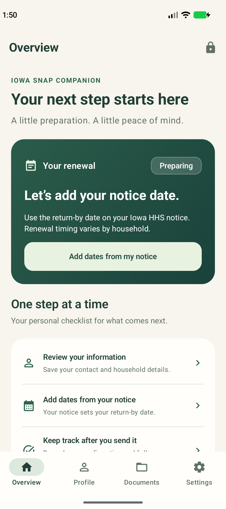
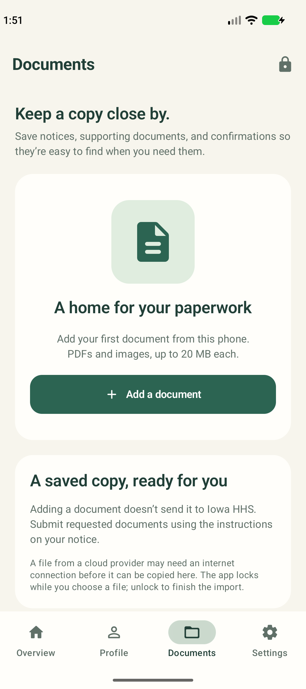
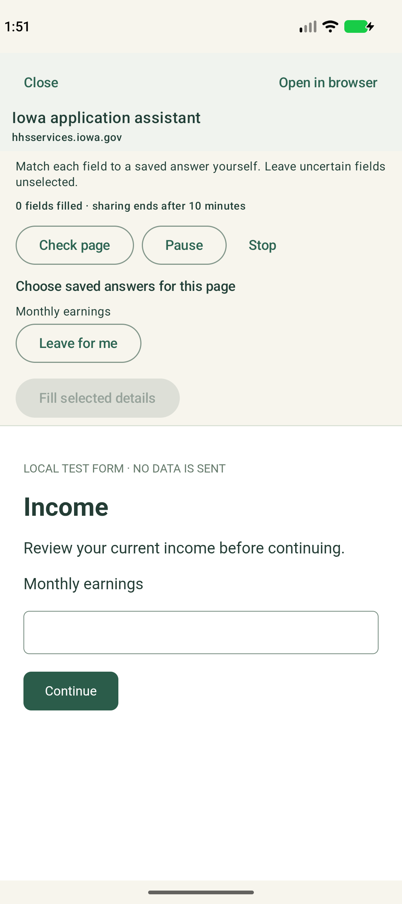

# Second Hand for Android

An offline Iowa SNAP companion built with Kotlin and Jetpack Compose. It follows the iPhone app's ivory and forest-green design, four-tab layout, notice-based renewal tracker, and encrypted personal document vault.

The in-app browser provides the same guided application workflow as the iOS assistant: share saved answers for ten minutes, fill verified applicant fields, explicitly map other eligible fields, review each page, sign on Iowa's website, and separately approve submission. A confirmation is recorded only after the user checks Iowa's result and supplies its number.

**This is a prototype. Live Iowa filing and authenticated renewal remain unverified.** It does not determine eligibility, synchronize an agency case, or automatically renew benefits on a schedule. The dates on the user's HHS notice control the renewal plan.

<p>
  
  
  
</p>

Screenshots are from the emulator. The assistant image uses a local test form, not Iowa's live website.

## Open in Android Studio

1. Clone this entire repository. The Android build packages shared JavaScript from `../extension/` and `../ios/`; copying only this folder is insufficient.
2. In Android Studio, choose **Open** and select this `android` directory.
3. Install Android SDK Platform 36 and Build Tools 36.0.0 through SDK Manager. Let Gradle sync finish. Use Android Studio's bundled JDK 21, matching the project's Gradle daemon configuration.
4. Select the `app` run configuration and an Android 11/API 30 or newer emulator or phone, then press **Run**.
5. Set a device PIN/password or supported strong biometric to unlock the app normally. No Second Hand account is needed.

You can demo on an emulator or your own Android phone without a Google Play developer subscription. For a phone, enable Developer options and USB debugging, connect it, and approve that computer on the phone. See [Android's device setup guide](https://developer.android.com/studio/run/device).

Command-line build from this folder:

```sh
./gradlew :app:assembleDebug :app:testDebugUnitTest :app:lintDebug
```

If the SDK is not found, let Android Studio create the ignored `local.properties` with your SDK path. On this Mac, a command-line build can use Studio's JDK:

```sh
JAVA_HOME='/Applications/Android Studio.app/Contents/jbr/Contents/Home' ./gradlew :app:assembleDebug
```

The debug APK is generated at `app/build/outputs/apk/debug/app-debug.apk`. Release builds require your own signing key before distribution. Signing keys and local SDK paths are excluded from Git.

## Demo and tests

The native profile, renewal planner, and documents work offline. Opening the Iowa portal and sending an application require internet access. Do not submit a real application simply to test the app.

For automated tests and synthetic emulator demonstrations, **Debug builds on an emulator only** accept:

```sh
adb shell am start -n com.ethanpam.secondhand/.MainActivity --ez ui_testing true
./gradlew :app:connectedDebugAndroidTest
```

The release app cannot use this bypass. Debug builds also require emulator-detection checks based on Android build properties; this test convenience is not a production authentication mechanism. Instrumented tests use synthetic information in a dedicated emulator; do not run tests against a personal installation containing real data.

Shared form-engine tests run from the repository root:

```sh
npm ci --ignore-scripts
node --test ios/Tests/*.test.js android/tests/*.test.js
```

See [validation results](docs/Validation.md) for actual checks and remaining device work.

## How application assistance works

1. Save and confirm the current profile. Review income and housing amounts before sharing them.
2. Explicitly authorize ten minutes of application sharing and open the assistant.
3. Complete login, CAPTCHA, preliminary program choices, and unsupported steps yourself on Iowa's site.
4. Start assistance on a supported application page. Verified applicant fields fill from the approved snapshot. Other eligible fields require an explicit saved-field choice for that page.
5. Complete missing questions, refresh the preview, and choose Continue. Existing answers are preserved. Pause and Stop interrupt assistance.
6. Review the application and complete the website's signature yourself. A recognized submission step requires a separate native approval before one website button click. The app never automatically retries submission.
7. Check the result and record the confirmation. Tracker status is **user-reported**, not an agency status check.

The assistant uses **AndroidX WebKit's isolated JavaScript world**, checked at runtime. Older WebView providers retain manual browsing and an external-browser option; there is no less-isolated automatic fallback. Keep Android System WebView updated. See [AndroidX WebKit documentation](https://developer.android.com/reference/androidx/webkit/WebViewCompat).

Document uploads and portal features that reject embedded browsers require **Open in browser** in this prototype. That browser may need a separate sign-in; an in-app application session is not transferred to Chrome. The assistant cannot fill another browser's pages.

Backgrounding the app locks the vault and ends the assistant session. Reopen the assistant and sign in again if needed; the app does not preserve a browser session through a lock or process restart. Use Iowa's own save/resume feature before leaving an unfinished application.

The verified applicant adapter is packaged directly from the laptop extension, and the DOM inspection/filling/action engine directly from iOS. Android supplies native controls and transport. No Chrome extension installation or cloud automation server is involved. See the [shared pipeline and page coverage](../ios/docs/Application-assistant.md).

## Privacy

Profiles and documents stay encrypted in this app's private storage using an Android Keystore key. There is no backend, analytics, cloud sync, or recovery service. The Android, iOS, and desktop vaults are independent. Read [privacy and data handling](docs/Privacy.md) before entering real information.
