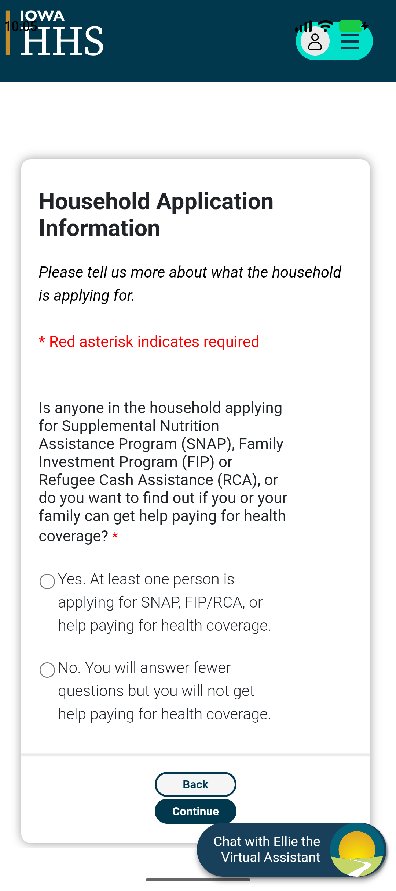
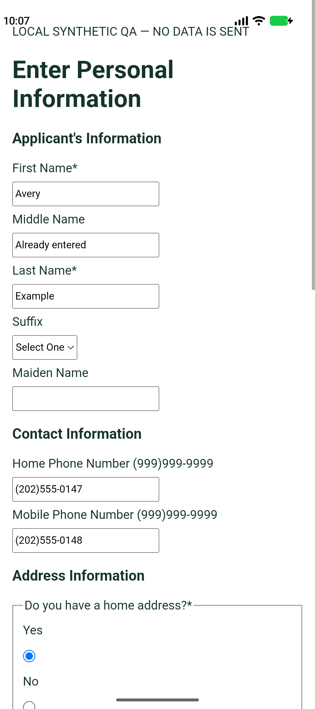

# Iowa guest application QA — September 26, 2026

Target: [Iowa's guest application entry](https://hhsservices.iowa.gov/apspssp/ssp.portal/applyForBenefits/guestLogin).

This QA separates a read-only check of the live website from fictional-answer tests in an isolated reconstruction. **It does not establish a successful live application or renewal.** The live site can save answers before final submission, including through **Save and Continue**, so no fictitious applicant answers were entered into the live website.

**Results: both focused Android tests passed** on the API 37.2 emulator with WebView 149.0.7827.5: the live entry check and the isolated applicant workflow, with no skips. The applicant fixture initially flagged WebView's default favicon request; the test now serves only that exact GET subresource locally and still rejects other unexpected requests.

After incorporating concurrent upstream changes to the shared Iowa adapter, the full Android regression suite passed **seven tests**, with only the deliberately opt-in live check skipped. All **88 shared mobile JavaScript tests** and the repository JavaScript/configuration checks also passed. The earlier focused live check remains separate evidence of entry-page compatibility.

## Issue found and fixed

The mobile engine treated **Select Address** as a generic form. A local reproduction with a visible address error still offered Continue and clicked it, bypassing the laptop adapter's newer address checks. The shared iOS/Android engine now keeps the observed `addressValidation` route or **Select Address** heading manual: it offers no saved fields or native Continue action there. The user chooses and confirms the address on Iowa's website. Regressions cover normal, error, and dialog states, plus independent route/heading recognition. This fix does not enable the laptop's automatic first-address selection on mobile.

<p>
  
  
</p>

Left: blank live entry. Right: reconstructed local form with fake answers. These screenshots show controller test WebViews, not the app's complete native assistant screen.

## Live entry check

The Android emulator loaded the exact requested URL with the production assistant controller and WebView 149.0.7827.5. It displayed **Household Application Information**; the security-check controls were present in its DOM. The test observed 120 GET requests and no non-GET requests; its test-only WebView intercepted non-GET requests before network handling.

A fictional profile was saved into a separate encrypted Android vault, locked, reloaded, and authorized for sharing. Starting assistance at `guestLogin` correctly refused to release it: zero fields filled, no preview, and no native bridge visible to website JavaScript. No radio answer, CAPTCHA answer, Continue, signature, or submission was performed by this live Android test.

A separate Chrome inspection selected the initial Yes radio to reveal the CAPTCHA, without pressing Continue or entering applicant information. The security check requires manual completion before inspecting the next blank live form. No full live applicant autofill, draft save, address verification, signature, or submission was tested.

## Fictional applicant workflow

`ApplicantSchemaQATest` uses the production Android vault, controller, shared Iowa adapter, and isolated JavaScript world. Its HTML is generated from the repository's [sanitized applicant schema](../../tests/fixtures/iowa-personal-information.cjs), which reconstructs observed labels, IDs, types, form metadata, and conditional handlers. It is **not a live page capture**. Network loads are disabled, all requests are intercepted, and the fixture's content-security policy prohibits network connections and form submission.

The fictional profile uses Avery Jordan Example, reserved `555-01xx` telephone numbers, `example.invalid` email, and an invented street address. Loading this profile happens through the test store's `saveProfile` path and a real encrypted save/reload. Android currently has no JSON profile-import screen; this is not a file-import UI test.

The workflow checks:

1. The exact guest-login route cannot receive profile values.
2. Applicant first/last name and typed home/mobile phone fill automatically. An existing middle-name answer is preserved.
3. Home-address, applicant, and SNAP choices remain manual; hidden address fields stay empty.
4. After explicit synthetic user choices reveal the address, five address fields fill, including the ZIP key translation. Nine fields are filled in total; the existing middle name is unchanged.
5. Missing required choices prevent Continue. Changing an answer after a complete preview invalidates that preview, with zero Save and Continue clicks or POST requests.
6. The tracker remains Preparing, and Stop revokes sharing.

Email, income, and housing amounts have no verified controls on this applicant page and are not filled there. Mailing-address decisions, program selections, CAPTCHA, and later unverified pages still need user input. The Android app opens the portal home by default; this QA supplies the exact guest URL through an internal test-only WebView factory.

## Reproduce

Use a dedicated emulator with a WebView provider supporting isolated-world execution. From the repository root, verify the generated reconstruction:

```sh
node android/scripts/export-applicant-qa-fixture.cjs --check
```

To regenerate after reviewing a shared fixture change, omit `--check`. The asset records the source's SHA-256 digest.

Run the isolated applicant test from `android/`:

```sh
./gradlew :app:connectedDebugAndroidTest \
  -Pandroid.testInstrumentationRunnerArguments.class=com.ethanpam.secondhand.assistant.ApplicantSchemaQATest
```

The live check is **skipped by default**. Run it only when deliberately checking the live entry page:

```sh
./gradlew :app:connectedDebugAndroidTest \
  -Pandroid.testInstrumentationRunnerArguments.class=com.ethanpam.secondhand.assistant.LiveGuestEntryQATest \
  -Pandroid.testInstrumentationRunnerArguments.liveIowaEntry=true
```

Reports and screenshots are exported through Gradle's connected-test output directory. They contain either a blank live entry page or explicitly fictional local fixture data. Captures use a test-only temporary secure-window override; production screenshot protection is unchanged.
