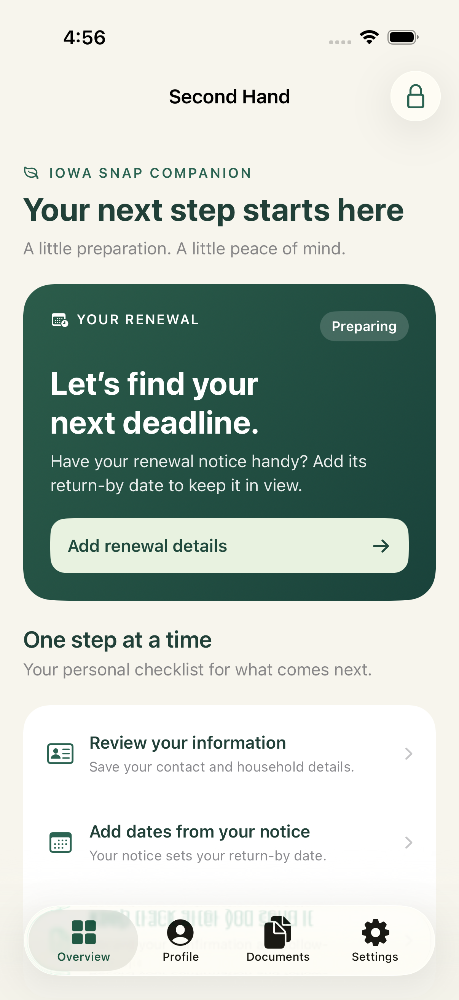
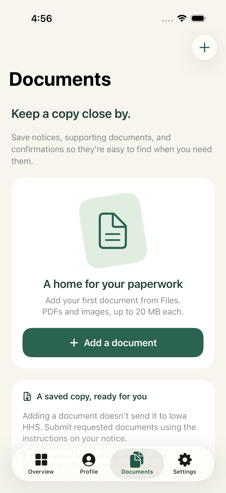
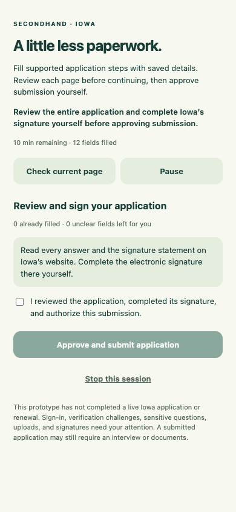

# SecondHand

An offline-first iPhone app for keeping an Iowa SNAP profile, documents, and renewal tasks together. Its Safari extension provides a user-started application assistant: fill saved answers, review each step, and separately approve submission.

This is an independent prototype, not an Iowa HHS product. It does not determine eligibility or synchronize with an agency case. Submission requires the user's review, signature on Iowa's website, and explicit approval. Confirmation numbers and application statuses are user-reported.

## What is included

- A SwiftUI app for a saved contact and household profile, income and housing notes, and renewal tracking.
- Separate dates for renewal return, benefits ending, interview, and requested documents. Dates come from the user's notice; the app does not assume annual renewal.
- An encrypted local document vault and document preview.
- On-device text extraction from saved PDFs, JPEGs, PNGs, and HEIC images, plus camera document scanning on supported iPhones.
- Local reminders with generic wording on the lock screen.
- A required four-digit SecondHand PIN with optional Face ID, enabled in Settings. Face ID failures fall back to the app PIN.
- A Safari extension with an expiring, one-tab application session; automatic filling of verified applicant fields; user-selected mappings on other supported forms; Pause/Resume/Stop; and separate Continue and final submission actions.
- An encrypted handoff of a user-entered website confirmation to the app's renewal tracker.

Saved information and reminders work offline. Opening the Iowa website, signing in, uploading proof, and submitting an application require internet access.

**Second Hand has no app account or sign-in.** You can demo it without a paid Apple Developer subscription: Simulator needs no Apple account, and testing on your own iPhone uses a free Apple account in Xcode. An Iowa benefits-portal account is only relevant when using the official website. Apple's [account guidance](https://developer.apple.com/help/account/basics/about-your-developer-account) explains free personal-device testing and its limits.

 

## Scan documents and read text

In **Documents**, choose **Scan a document** to capture pages with the camera, or **Add a document** to import a PDF or image from Files. Scans are saved as encrypted PDFs. The camera option appears only where document scanning is supported; Simulator can test imported files instead.

Choose **Read text** on a saved document to extract text locally using Apple Vision. Selectable PDFs use their existing text; scanned PDF pages and images use recognition. Review the result against the original, especially amounts, columns, and checkboxes. Text review does not change profile fields or send text to a server. You can select text using the standard iOS text-selection controls. Extracted text is not saved separately and is cleared when the review closes or the app locks.

In **Set up my profile**, choose **Upload or scan a document**. Upload a completed 1040/1040-SR, scan it on a supported iPhone, or select one from **Saved documents**. The same bounded-cell parser used by desktop proposes the primary taxpayer’s name and domestic address. Review/edit the candidates, deselect anything you do not want, confirm the details belong to you and are current, and choose **Use selected details**. They fill the unsaved profile draft; the usual review and **Save** step is still required. Other draft fields are preserved. Historical tax amounts are not converted to current monthly income, and the home-address Yes/No answer remains yours to select. Unrecognized layouts or multiple taxpayer headers require manual entry.

Documents are limited to 20 MB; text extraction and camera scans support up to 20 pages. Camera access can be enabled in iPhone Settings if previously denied.

QA uses the explicitly synthetic, not-for-filing 1040-SR in `Tests/Fixtures`. It is included only in the unit-test bundle, not the shipping app. Tests check names, address, and selected amounts against the scan, plus image recognition, blank/invalid input, page ordering, and the page limit. Camera capture still requires a physical-device check.

## Application assistance scope

[Watch the live iPhone Safari QA video](https://github.com/ethanpam/secondHand/blob/e411cfbbf77f7e0169c3ca0c6afea2fa35da2c4f/ios/docs/qa/iphone-live-safari-demo.mp4) · [QA results and offline demo](docs/qa/README.md)

The live recording shows the installed Safari extension selecting the home-address **Yes** answer and filling **10 fields** from a fictional saved profile on Iowa's applicant form, in one Start action. It runs in iPhone Simulator and verifies native sharing through to the real website. The test stopped before the applicant page's **Save and Continue**, signature, or submission.

**This is a guided auto-apply prototype, not a verified end-to-end Iowa integration.** The app shares the laptop implementation's inspected primary-applicant schema and verified Continue/required-question checks. Live application submission, physical-device behavior, and an authenticated SNAP renewal flow remain unverified. Automated tests use synthetic local forms; the recorded live test was separately authorized with awareness that Iowa may save filled fields before submission.

The assistant automatically matches first/middle/last name, explicit home/mobile phone numbers, and home address on the [inspected applicant page](../docs/iowa-portal.md). For other eligible text/select fields, the user must explicitly choose which saved answer belongs there. These mappings apply only to the current page; the assistant does not guess household, eligibility, or financial semantics.

If you saved a **Yes** or **No** answer to **Do you have a home address?** in your profile, the assistant selects it on the verified, unanswered question. With no saved answer, the question is left for you; the assistant never infers it from your address. It answers whenever it runs on the applicant page: on **Start application assistance**, on **Resume**, and when the page loads after an extension **Continue**. It uses Iowa's normal choice control. After **Yes**, it scans the newly revealed fields again and fills the address in the same run. It preserves existing Yes/No answers and refuses a choice that could reset existing home or mailing details. If it can't select your saved answer, the extension tells you the question was left for you.

Application sharing expires after at most ten minutes. Its approved snapshot can include name, email, typed phone numbers, home address, your saved Yes/No home-address answer, monthly income, and monthly housing cost. Generic phone, household members, notes, documents, birth dates, SSNs, and passwords are excluded. The user handles login, CAPTCHA/verification, program choices, uploads, consent, and signatures on the website.

Each **Continue** requires a user action. On a recognized **E-Signature** page, the user completes Iowa's signature, checks the extension's approval box, and clicks **Approve and submit application**. The assistant checks that the reviewed page is unchanged, uses the website's normal button once, and does not retry submission automatically. The user must read the result and enter its confirmation number; a click alone never marks the tracker submitted. Unrecognized signing/submission pages remain manual.



*Extension approval screen rendered with local mock state; this is not a live Iowa session.*

The extension is for Safari on iOS. It does not add extension support to Chrome on iOS.

## Open and build

Requirements: a Mac with **Xcode 26.6**, Python 3 to regenerate the project, and an **iOS 17 or later** device or simulator. Node.js is needed only for the JavaScript tests. There are no third-party app dependencies.

Open `ios/SecondHand.xcodeproj` from the repository root in Xcode and select the `SecondHand` scheme. All commands below run from the `ios/` directory (`cd ios` first). The repository includes the project; regenerate it after changing the source layout or target configuration with:

```sh
python3 scripts/generate_project.py
```

Compile for the simulator without device signing (this checks the build only; use the demo steps below to run the app):

```sh
DEVELOPER_DIR=/Applications/Xcode.app/Contents/Developer xcodebuild \
  -project SecondHand.xcodeproj \
  -scheme SecondHand \
  -sdk iphonesimulator \
  -destination 'generic/platform=iOS Simulator' \
  CODE_SIGNING_ALLOWED=NO build
```

`DEVELOPER_DIR` selects Xcode for this command without changing the Mac's global developer-tool setting. Use the path to your Xcode installation if it differs.

## Demo in Simulator for free

No iPhone, Apple sign-in, or paid membership is needed. Apple also supports [testing Safari web extensions in Simulator](https://developer.apple.com/documentation/safariservices/running-your-safari-web-extension) before joining the Developer Program.

1. Open `ios/SecondHand.xcodeproj` in Xcode and select the **SecondHand** scheme.
2. In the destination menu beside the Run button, select an available **iPhone Simulator**.
3. Open **Product → Scheme → Edit Scheme → Run → Arguments**. Add and enable `--ui-testing` under **Arguments Passed On Launch**.
4. Click **▶ Run** or press **Command-R**, then explore the app using made-up sample information.

The launch argument skips the device-authentication gate only in a **Debug Simulator build**. It has no effect on a physical iPhone or in a Release build. Keep Xcode's default local signing enabled: the app needs its Keychain and App Group entitlements even in Simulator. Do not use `CODE_SIGNING_ALLOWED=NO` for an interactive demo.

## Demo on your iPhone for free

You can install the app directly from your Mac with a **free Apple account / Personal Team**. You do not need to enroll in the paid Apple Developer Program for this personal-device demo. Apple's current [iOS capability matrix](https://developer.apple.com/help/account/reference/supported-capabilities-ios) includes App Groups and Keychain sharing for free Apple Developer accounts; provisioning still needs to succeed for your own account and identifiers.

1. Connect your iPhone to the Mac with a data-capable USB cable. Unlock it and tap **Trust This Computer** if prompted. Create a four-digit SecondHand PIN on first launch, then optionally enable Face ID in the app’s Settings. Existing saved profiles require one verification with the previous device authentication before PIN setup.
2. In **Xcode → Settings → Apple Accounts**, add your Apple account and complete sign-in. Internet access is needed for Xcode to set up signing.
3. Open `ios/SecondHand.xcodeproj`. Select the blue project icon, then the **SecondHand** target. Under **Signing & Capabilities**, enable **Automatically manage signing** and choose your **Personal Team**. Repeat for the **SafariExtension** target using the same team.
4. Select the **SecondHand** scheme and your connected **iPhone** in Xcode's destination menu, then click **▶ Run** or press **Command-R**.
5. If Xcode asks for Developer Mode, open **Settings → Privacy & Security → Developer Mode** on the iPhone, turn it on, and follow the restart and confirmation prompts. Unlock the phone and run the app from Xcode again. If the setting is missing, let Xcode recognize the connected phone first.

See Apple's [device setup instructions](https://developer.apple.com/documentation/xcode/running-your-app-on-simulated-or-physical-devices) and [Developer Mode guide](https://developer.apple.com/documentation/xcode/enabling-developer-mode-on-a-device).

Once installed, you can disconnect the cable and demo the offline features. Free Personal Team provisioning lasts **7 days**; rebuild and run from Xcode with the same team and identifiers after it expires. You do not need to delete the app to renew it. Paid membership is needed for distribution through TestFlight or the App Store, not this personal-device demo. See [Apple's account guidance](https://developer.apple.com/help/account/basics/about-your-developer-account).

### Signing identifiers

The repository contains no development-team credentials. Both targets must use matching App Group and Keychain settings:

| Setting | Value |
| --- | --- |
| App bundle identifier | `com.ethanpam.secondhand` |
| Safari extension bundle identifier | `com.ethanpam.secondhand.SafariExtension` |
| Shared App Group | `group.com.ethanpam.secondhand` |
| Shared Keychain access group | `$(AppIdentifierPrefix)com.ethanpam.secondhand.shared` |

If Xcode reports that these identifiers are unavailable to your team, change them consistently in `scripts/generate_project.py`, both targets' entitlements and `Info.plist` files, and matching source constants in `SecondHand/Core/SecureVault.swift`, then regenerate the project. Recheck the signing team after regeneration. App Groups and shared Keychain access must resolve to the same values in both signed targets. An identifier conflict does not mean you need a paid subscription.

### Try Safari autofill (optional)

After installing the app, enable SecondHand in Safari's extension settings and grant access to `hhsservices.iowa.gov`. On current iOS versions, Safari settings are under **Settings → Apps → Safari → Extensions**; older versions place Safari directly in Settings.

1. Save and confirm your profile in the app. In **Settings**, choose **Allow application sharing for 10 minutes** and review the sharing confirmation.
2. Open the official portal in Safari and navigate to the application. Any sign-in here uses your **Iowa benefits-portal account**, not an Apple or Second Hand account. Complete preliminary consent and verification yourself.
3. Open SecondHand from Safari's extension menu, choose **Start application assistance**, and allow access to the Iowa website. The session is bound to this tab.
4. Review automatically filled applicant details, including your saved Yes or No to **Do you have a home address?**. On an unfamiliar form, choose a saved answer for each field you want filled, then select **Fill selected details**. Leave uncertain matches unselected and answer them on the website.
5. Finish remaining questions, choose **Check current page** to refresh the review, and use **Continue to next step**. Pause or Stop is available during filling. A paused session resumes only when you choose Resume.
6. On the final signing page, review the full application and complete its signature on Iowa's website. Then separately approve submission in the extension. If the page is unsupported, use the website directly.
7. Read Iowa's result. When the assistant recognizes a confirmation page, enter the confirmation number and confirm that Iowa reports submission. Unlock SecondHand to import the encrypted receipt into your tracker. If the receipt page is unrecognized, record the number manually in the app.

You do not need to create or submit an Iowa application to demo the native app. Follow the instructions on your HHS notice for recertification; the assistant does not automatically reapply on a schedule. See the [application pipeline and limitations](docs/Application-assistant.md).

## Tests and validation

The app and extension compile with Xcode 26.6 for physical iPhones. Native tests cover encrypted persistence, migration, reminders, and receipt import; JavaScript tests cover page operations, the background/popup workflow, and a local multi-page application. See [validation notes](docs/Validation.md) for results and remaining device checks.

Install the repository's pinned test dependencies from the repository root once with `npm ci --ignore-scripts`, then run the JavaScript tests from `ios/`:

```sh
node --test Tests/*.test.js
```

Run the native test target through **Product → Test** in Xcode using an available iPhone simulator. For a command-line run, replace the destination below with a simulator shown by `xcodebuild -showdestinations -project SecondHand.xcodeproj -scheme SecondHand`:

```sh
DEVELOPER_DIR=/Applications/Xcode.app/Contents/Developer xcodebuild \
  -project SecondHand.xcodeproj \
  -scheme SecondHand \
  -destination 'platform=iOS Simulator,id=YOUR_SIMULATOR_UDID' \
  CODE_SIGN_IDENTITY=- test
```

Tests use local ad-hoc signing so the Simulator can enforce the app's Keychain and App Group entitlements. Unlike the compile-only command above, do not disable signing for an interactive run or UI test.

Automated UI tests use the same Debug Simulator-only `--ui-testing` authentication bypass described in the Simulator demo steps above. Simulator UI testing does not validate Face ID, Touch ID, or device-passcode behavior.

Before distributing the app, validate signed App Group and Keychain sharing, biometrics and device-passcode authentication, document lifecycle, notifications, accessibility, and Safari behavior on a real device. Physical-device authentication and authenticated live SNAP-case testing remain pending. No App Store release has been performed.

## Data and Iowa guidance

The app uses an AES-GCM encrypted local vault, device-only Keychain keys, complete file protection, and backup exclusions. It has no backend, analytics, or cloud synchronization. There is no automatic recovery if the device or key is lost. Read [Privacy and data handling](docs/Privacy.md) for the storage and Safari-sharing boundaries.

Iowa SNAP renewal is not universally annual. Follow the actual return-by date and required tasks in your Iowa HHS notice. Official links and the limits of the verified portal research are recorded in [Iowa sources](docs/Iowa-sources.md), reviewed September 26, 2026.
